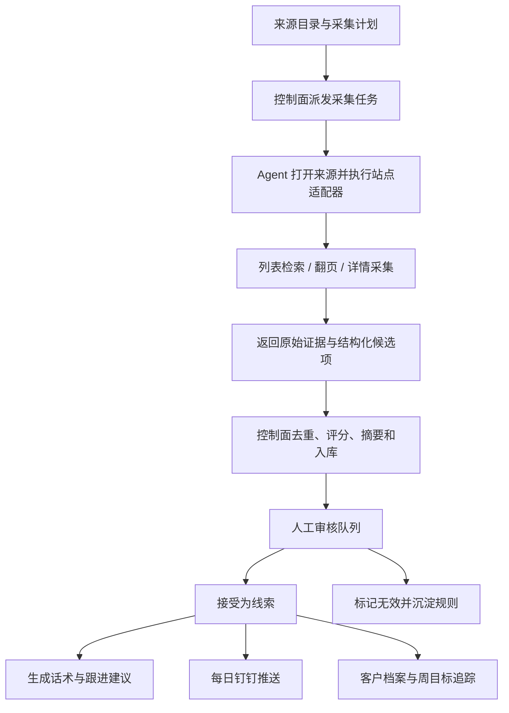

# 智能商机挖掘助手设计方案

## 1. 设计结论

本方案把“智能商机挖掘助手”定义为一个本地部署的商机采集、筛选、审核、推送和跟进系统。核心价值不是做一个泛化聊天机器人，而是每天把分散在政府采购、公共资源、区域政府、行业媒体、华为生态、企业数据平台和微信公众号里的线索，转换成可审计、可排序、可跟进的候选商机。

参考 `crawler-monitor` 的抓取模式，建议采用“控制面负责调度、状态、入库和审核，Agent 负责浏览器会话和站点适配器执行”的架构：

- 控制面统一管理来源目录、采集计划、采集结果、审核队列、钉钉推送、客户跟进和运行日志。
- Agent 通过长连接注册、心跳和接收采集命令，实际打开网页、处理登录态、执行检索、翻页和详情采集。
- 每个来源用独立站点适配器封装检索、列表解析、详情抽取、分页策略和失败诊断。
- Agent 只上报结构化采集事件，不直接写业务库；去重、评分、审核状态、推送状态由控制面统一处理。
- AI 能力用于摘要、事实抽取补充、需求分析和话术生成，但必须保留原文证据，并区分“提取事实”和“推断分析”。

## 2. 输入资料分析

### 2.1 需求调研文档要点

需求调研文档中的关键约束如下：

- 智能体名称：智能商机挖掘助手。
- 目标用户：业务经理 1 人、交付服务中心经理 1 人、业务副总经理 1 人。
- 当前痛点：
  - 新客户开发依赖手工搜索、微信公众号、短视频等渠道；
  - 客户信息分散，联系人经常缺失；
  - 目标客户画像不清，约 60% 拜访无效；
  - 年度目标没有有效拆到周目标和过程动作；
  - 对 AI、华为生态方案的业务价值表达不稳定。
- 当前量化基线：
  - 每周约 20 小时用于新客户开发；
  - 每月约 5 个有效商机；
  - 当前新增客户约 0 家/月；
  - 当前商机转化率约 15%。
- 目标：
  - 新客户开发效率提升 3 倍，每周从 20 小时降到约 7 小时；
  - 每月自动挖掘 20 条有效新商机；
  - 新增客户数量达到 ≥5 家/月；
  - 商机转化率达到 ≥30%；
  - 个人签约额目标从不足 100 万提升到 1000 万；
  - 客户匹配准确率验收目标 ≥80%。
- 目标客户画像：
  - 行业：四新企业、政府、医疗、教育、金融；
  - 地区：昆山市、太仓市、常熟市、张家港市；
  - 规模：年产值 20-200 亿；
  - 项目阶段：规划、土建建设、设计；
  - 需求关键词：数字化转型、AI 应用、云计算等。
- 核心功能：
  - 智能客户匹配；
  - 每日商机推送；
  - 客户开发话术生成；
  - 周目标追踪；
  - 客户档案管理；
  - 对接销帮帮 CRM 和钉钉。
- 非功能要求：
  - 本地化部署；
  - 支持 2 人并发；
  - 客户匹配响应 ≤5 秒；
  - 话术生成响应 ≤3 秒；
  - 支持权限分级、操作日志、敏感数据脱敏和加密存储；
  - 2026-05-31 前上线。

### 2.2 Excel 渠道清单要点

Excel 给出的渠道可以分为七类：

| 类别 | 代表来源 | 设计定位 |
| --- | --- | --- |
| 政府采购与招标 | 中国政府采购网、全国公共资源交易平台、中国招标投标公共服务平台、江苏省政府采购网、江苏省公共资源交易平台、苏州市公共资源交易平台、建设网 | 首批最高优先级来源，直接产生项目、招标、意向公告和工程建设线索 |
| 企业大数据平台 | 天眼查、企查查、爱企查、启信宝、国家企业信用信息公示系统 | 用于补全企业规模、地址、行业、经营状态和联系人线索；不建议首批做深度自动抓取 |
| 华为官方与生态 | 华为企业业务、华为坤灵、华为云、华为大会活动 | 用于补充华为生态材料、活动线索、行业方案和销售话术背景 |
| 行业展会 / 峰会 | 数博会、智博会、工博会、智慧城市博览会 | 用于发现高意向参展企业、行业趋势和潜在项目 |
| 行业垂直平台 | 中国电子政务网、智慧城市网、工业互联网世界网、赛迪网、至顶网、亿欧 | 用于政策、行业动态、竞品中标和数字化趋势补充 |
| 政府部门 | 国家发改委、工信部、国家数据局、江苏省工信厅、苏州市大数据局 / 工信局、昆山市政府网 | 用于抓政策、规划、项目公示、专项资金和区域建设动态 |
| 微信公众号 | 昆山发布、苏州发布、太仓发布、常熟发布、张家港发布 | 价值高但自动化不稳定；首版建议支持人工导入或半自动采集 |

首批应优先抓“能稳定公开访问、结果结构化程度较高、和项目机会直接相关”的来源。企业大数据平台、微信公众号和需要登录的建设网应作为第二阶段增强，避免首版被登录、反爬和账号合规拖慢。

## 3. 产品范围

### 3.1 MVP 必做

- 维护线上线索来源目录，来源信息来自 Excel 渠道清单。
- 对首批高优先级来源做定时采集，采集框架同时支持“不要求登录”的公开网站和“要求登录”的账号型网站。
- 从公告、政策、项目、新闻和活动页面中抽取候选商机。
- 保留原始证据、来源链接、发布时间、标题、组织名称、地区、行业、项目阶段和摘要。
- 按目标客户画像进行可解释评分。
- 提供人工审核队列：接受为线索、标记无效、更新跟进状态和拜访备注。
- 每日通过钉钉推送高优先级商机摘要。
- 为已接受线索生成电话开场、拜访要点、价值主张和异议处理。
- 提供周目标追踪：拜访、报价、商机数量的目标和完成情况。
- 提供基础客户档案和历史搜索。
- 展示采集源健康状态：最近成功时间、最近失败原因、是否需要登录或人工维护。

### 3.2 首版不做

- 不承诺抓取所有 Excel 中列出的来源。
- 不做完全自主外呼或自动销售触达。
- 不在没有 CRM API 字段确认前直接写入销帮帮。
- 不把 AI 推断当成事实；不得生成不存在的联系人和电话。
- 不把企业大数据平台作为首批深度爬取核心，先用于人工补全或后续授权采集。
- 不做复杂机器学习模型，首版用规则评分 + AI 可解释摘要。
- 不做通用知识库平台，只存商机判断和跟进所需证据。

## 4. 目标使用流程



每日业务流程：

1. 系统凌晨或早上采集高优先级来源。
2. 控制面完成去重、规则评分、摘要和优先级排序。
3. 钉钉在工作日上午推送“今日高优先级商机”。
4. 业务经理进入审核队列，查看证据和匹配原因。
5. 有价值的候选项被接受为线索，并生成拜访话术。
6. 业务经理记录电话、拜访、报价、赢单或丢单状态。
7. 业务副总经理查看本周目标进度和商机转化数据。

## 5. 抓取架构设计

### 5.1 复用的抓取模式

参考项目中值得复用的模式有六个：

- 控制面 / Agent 分离：控制面只调度和持久化，Agent 持有浏览器并执行网页动作。
- 长连接协议：Agent 注册、心跳、接收命令、上报事件，控制面可以观察在线状态和失败。
- 保留浏览器会话：对需要登录的来源，用持久化浏览器上下文保留登录态。
- 站点适配器：每个目标站点单独封装检索、翻页、解析和错误诊断。
- 人类化动作层：对复杂网页使用鼠标移动、逐字输入、滚动、随机停顿和有界翻页。
- 中心化入库：Agent 返回结果，控制面负责去重、入库、审计和后续推送。

### 5.2 商机采集组件

建议组件拆分如下：

| 组件 | 职责 |
| --- | --- |
| 来源目录 | 存储来源类别、名称、URL、优先级、地区、登录要求、关键词策略和启用状态 |
| 采集调度器 | 根据来源优先级、频率、失败退避和维护状态生成采集任务 |
| Agent 运行时 | 管理浏览器会话、并发容量、登录态、任务执行和心跳 |
| 适配模式注册表 | 为不同站点声明适配模式、登录模式、检索方式、分页方式和详情抽取方式 |
| 共性采集模块 | 统一提供会话、导航、检索、翻页、列表解析、详情抽取、附件处理、风险识别和快照诊断 |
| 站点适配器 | 只保留站点差异配置和少量特殊逻辑，复用共性采集模块完成采集 |
| 规范化管道 | 把来源页面转换为统一候选商机字段 |
| 去重管道 | 基于 URL、标题、组织名、发布时间、内容指纹和来源 ID 去重 |
| 评分管道 | 根据地区、行业、项目阶段、规模、关键词、来源优先级打分 |
| AI 分析管道 | 生成摘要、需求判断、跟进建议和话术；保留推断依据 |
| 审核队列 | 支持接受、拒绝、备注、跟进状态和反馈规则 |
| 推送服务 | 每日钉钉摘要、失败告警、周目标提醒 |
| 运营日志 | 记录采集、审核、推送、登录、异常和用户操作 |

### 5.3 登录模式支持

采集能力必须覆盖两类网站，来源目录中用登录模式区分：

| 登录模式 | 适用来源 | 采集方式 | 运行要求 |
| --- | --- | --- | --- |
| 不要求登录 | 政府采购网、公共资源交易平台、政府部门网站、公开行业媒体 | 直接打开网页，按关键词、地区和日期检索，采集列表和详情页 | 可定时自动采集；失败后按退避策略重试 |
| 要求登录 | 建设网、企业大数据平台、部分需要账号的行业平台 | 由操作员先在 Agent 浏览器中完成登录，系统保留浏览器会话和账号状态，再执行低频采集 | 必须显示登录状态、登录失效、账号维护人和最近会话健康 |

登录类来源的处理原则：

- 首次采集前，控制面发起 `open_source_session`，Agent 打开浏览器，由操作员人工完成登录。
- 登录完成后，Agent 保留持久化浏览器上下文，后续采集复用该会话。
- 登录态失效、出现验证码、出现风控或账号异常时，Agent 上报 `login_required` 或 `operator_intervention_required`，控制面停止自动重试并提醒操作员。
- 登录类来源默认低频采集，避免高频访问影响账号稳定。
- 同一个登录账号同一时间只能被一个 Agent 会话占用，避免并发登录互踢。
- 密码、Cookie、Token 和浏览器用户数据目录不进入普通业务日志和钉钉推送。

### 5.4 采集任务事件

采集任务建议沿用“命令 + 事件”的运行模式。

控制面下发：

- `start_collection_run`：启动某来源的一次采集。
- `stop_collection_run`：停止长任务或登录源任务。
- `open_source_session`：打开需要登录的来源会话。
- `release_source_session`：释放来源会话。

Agent 上报：

- `run_started`：采集开始。
- `page_opened`：目标页面可访问。
- `query_submitted`：检索条件提交成功。
- `page_collected`：列表页或详情页完成解析。
- `run_succeeded`：采集成功，携带候选项列表。
- `run_failed`：采集失败，携带失败原因和诊断快照。
- `login_required`：来源需要人工登录或登录态失效。
- `operator_intervention_required`：来源触发验证码、风控、账号异常或其他需要人工处理的问题。
- `run_stopped`：采集停止。

每个成功事件必须至少包含：

- `source_id`
- `run_id`
- `collected_at`
- `query_keywords`
- `page_count`
- `item_count`
- `items`
- `surface_snapshot`

`surface_snapshot` 用于诊断，不直接作为业务事实来源，可包含页面标题、当前 URL、分页停止原因、命中的选择器、页面摘要和错误截图路径。

### 5.5 站点适配模式与共性模块

不同站点不应各写一套完整采集流程。系统应先按站点形态选择适配模式，再由适配模式组合共性采集模块。站点适配器只描述差异：入口 URL、检索表单、关键词参数、列表选择器、详情选择器、分页规则、登录要求和风险识别补充规则。

适配模式建议如下：

| 适配模式 | 适用站点 | 共性流程 | 差异配置重点 |
| --- | --- | --- | --- |
| `public_search_list_detail` | 政府采购、公共资源、招投标平台 | 打开首页或搜索页 -> 输入关键词/地区/日期 -> 采集列表 -> 翻页 -> 进入详情 -> 抽取正文和附件 | 搜索框、日期控件、列表行、详情链接、分页按钮 |
| `public_channel_news` | 政府部门、行业媒体、华为生态栏目 | 打开栏目页 -> 按发布时间过滤 -> 采集列表 -> 进入文章详情 -> 抽取正文 | 栏目入口、发布日期位置、正文容器、栏目关键词 |
| `login_search_list_detail` | 建设网、企业大数据平台、账号型行业平台 | 打开保留会话 -> 确认登录态 -> 检索 -> 采集列表和详情 -> 失效时上报人工处理 | 登录态判断、账号占用、检索表单、低频调度 |
| `spa_or_ajax_search` | 前端渲染较重的平台 | 等待页面稳定 -> 触发检索 -> 等待接口或 DOM 更新 -> 抽取渲染结果 | 加载完成条件、空结果判断、翻页状态、超时策略 |
| `attachment_document` | 公告附件、PDF、Word、Excel | 下载或打开附件 -> 提取文本 -> 关联原公告 -> 进入规范化管道 | 附件链接、文件类型、文本提取、附件失败降级 |
| `manual_import` | 微信公众号、人工获取文章、临时来源 | 人工粘贴链接或正文 -> 统一抽取 -> 评分和审核 | 来源标注、原文证据、导入人、去重键 |
| `api_or_feed` | 有公开 API、RSS 或结构化接口的来源 | 调用接口 -> 解析结构化数据 -> 进入规范化管道 | 鉴权、分页参数、字段映射、限流 |

共性采集模块建议统一抽取为：

| 共性模块 | 职责 | 复用价值 |
| --- | --- | --- |
| 来源配置解析 | 读取登录模式、适配模式、关键词、地区、频率、选择器和限流策略 | 新增站点优先改配置，减少代码变更 |
| 会话管理 | 打开公共页面或登录会话，维护持久化浏览器上下文 | 同时支持无需登录和要求登录的网站 |
| 导航与人类化动作 | 统一处理页面打开、等待、点击、输入、滚动和停顿 | 降低站点适配器重复动作代码 |
| 查询构造 | 根据目标画像生成关键词、地区、日期范围和栏目过滤条件 | 统一召回策略，便于调优 |
| 列表解析 | 抽取标题、链接、发布时间、摘要片段和列表页证据 | 多站点共享列表结果格式 |
| 分页控制 | 支持下一页按钮、页码、滚动加载、接口分页和最大页数限制 | 防止死循环，统一记录停止原因 |
| 详情抽取 | 抽取正文、采购人、预算、地区、项目阶段、联系人和附件链接 | 保证候选项字段一致 |
| 附件文本处理 | 对 PDF、Word、Excel 等附件提取文本并关联原始公告 | 政采和招投标场景常见，避免每站重复做 |
| 风险识别 | 识别登录失效、验证码、风控、空结果、页面改版和网络异常 | 统一失败分类和操作员提示 |
| 证据快照 | 保存原文链接、关键正文、页面标题、分页状态和诊断信息 | 支撑 AI 可审计和故障定位 |
| 规范化映射 | 把不同站点字段映射为统一候选商机字段 | 后续评分、去重、审核、推送无需关心来源差异 |

每个站点适配器应只实现或配置以下差异点：

- `adapter_mode`：选择上表中的适配模式。
- `login_mode`：不要求登录或要求登录。
- `entry_url`：入口页、搜索页、栏目页或接口地址。
- `query_profile`：关键词组合、地区过滤、日期范围、栏目范围。
- `selectors_or_mapping`：列表、详情、分页、正文、附件、空结果和风险提示的定位规则。
- `pagination_policy`：最大页数、最大条数、停止条件和翻页等待方式。
- `rate_limit_policy`：采集频率、失败退避、登录类低频策略。
- `normalization_mapping`：来源字段到候选商机字段的映射。

微信公众号来源首版不建议直接做自动网页抓取。可先走 `manual_import` 适配模式，支持人工粘贴文章链接或导入文章内容，后续再评估合规和稳定的接口方式。

### 5.6 采集规则两层配置

采集规则分为“基础规则”和“高级规则”两层，避免把技术选择器暴露给普通业务用户，同时让运营人员可以自主调整商机召回范围。

| 规则层级 | 主要使用者 | 可配置内容 | 权限与校验 |
| --- | --- | --- | --- |
| 基础规则 | 业务经理、运营人员、管理者 | 来源启停、优先级、地区范围、行业关键词、需求关键词、排除关键词、采集频率、每日推送阈值、是否进入钉钉摘要 | 表单化配置；字段枚举和范围校验；变更写入审计日志 |
| 高级规则 | 技术人员、管理员 | 适配模式、入口 URL、登录模式、列表/详情/分页选择器、字段映射、附件抽取规则、风险识别规则、限流与失败退避策略 | 需要管理员权限；保存前做配置结构校验；支持试运行和版本回滚 |

基础规则示例：

- 关键词：智能化、弱电、数字化、AI、云平台、数据中台。
- 地区：昆山、太仓、常熟、张家港、苏州。
- 时间范围：最近 1 天、最近 7 天、最近 30 天。
- 采集频率：每天、每周、手动触发。
- 推送条件：匹配分 ≥70 或优先级为 P0/P1。

高级规则示例：

- `adapter_mode = public_search_list_detail`
- `entry_url = https://...`
- `list_selector`
- `detail_link_selector`
- `next_page_selector`
- `content_selector`
- `published_at_selector`
- `normalization_mapping`
- `risk_patterns`

规则版本管理：

- 每次保存高级规则时生成新的配置版本。
- 每次采集运行记录当时使用的配置版本，便于排查“规则变化导致抓取异常”。
- 高级规则支持“试运行”：只采集并展示预览结果，不入库、不推送。
- 高级规则保存后如果连续失败，应允许回滚到上一可用版本。

### 5.7 参考项目代码复用策略

实现时可以从参考项目 `crawler-monitor` 复制可复用能力到当前项目中改造使用。复制策略是“复用运行框架和成熟工具，替换业务语义”，不建议跨项目运行时依赖，也不建议直接保留支付巡检里的账号、交易号、支付宝命名。

优先复制和改造的模块：

| 参考能力 | 可复用内容 | 改造方向 |
| --- | --- | --- |
| Agent 注册与心跳 | Agent 长连接、注册、心跳、命令消费、断线处理 | 改造成商机采集 Agent，命令从巡检命令改为来源采集命令 |
| 控制面运行注册表 | 在线 Agent 管理、命令派发、运行事件入库 | 改造成采集运行注册表，按来源和任务追踪状态 |
| 浏览器运行时 | Camoufox 持久化浏览器上下文、会话保留、会话释放 | 用于要求登录的网站，按来源账号维护浏览器会话 |
| 会话管理 | 单账号单会话、容量控制、释放和健康检测 | 改造成单来源账号单会话，防止登录账号并发互踢 |
| 人类化动作 | 鼠标移动、逐字输入、滚动、随机停顿 | 作为共性采集模块，供复杂站点和登录站点复用 |
| 巡检循环 | 首轮立即执行、随机间隔、失败后继续或停止 | 改造成采集调度循环，按来源频率和失败退避执行 |
| 事件协议 | 命令、运行事件、成功事件、失败事件结构 | 改造成 `collection_event`，承载来源、页数、候选项和诊断快照 |
| 审计日志 | 操作日志、运行日志、失败原因记录 | 改造成采集、审核、登录、推送和敏感数据访问审计 |
| SQLite 迁移和本地部署 | 本地数据库、迁移、开发启动、打包思路 | 复用本地部署基础，但重建商机域表结构 |
| 管理界面信息架构 | 页面组织、列表、详情、运行状态展示 | 只参考信息架构；实际控制面前端采用 Vue 前后端分离，不沿用 SSR 技术形态 |
| 机会评分雏形 | 目标地区、行业、阶段、关键词的规则评分 | 保留思路，扩展为配置化画像和反馈调优 |

不建议直接复制的内容：

- 支付宝站点适配器、支付授权流程、交易号去重、投递回调等支付业务逻辑。
- `account`、`trade_no`、`inspection` 等会误导商机域的命名。
- 支付场景特有的状态机，除非先抽象成“来源会话”“采集运行”“候选商机”。

复制后的命名边界建议：

- `account` -> `source_account` 或 `credential_profile`
- `inspection` -> `collection_run`
- `normalized_record` -> `opportunity_candidate`
- `trade_no` -> `source_item_key` 或 `dedupe_key`
- `delivery` -> `dingtalk_digest` 或 `notification`
- `site_adapter` 保留，但业务输出改为候选商机字段

## 6. 首批来源优先级

### 6.1 P0 首批采集来源

| 来源 | 原因 | 采集方式 |
| --- | --- | --- |
| 中国政府采购网 | 全国采购公告，结构稳定，项目线索直接 | `public_search_list_detail` |
| 全国公共资源交易平台 | 覆盖工程建设和公共资源交易 | `public_search_list_detail` |
| 中国招标投标公共服务平台 | 招投标信息集中，适合竞品和项目机会发现 | `public_search_list_detail` |
| 江苏省政府采购网 | 区域相关性高 | `public_search_list_detail` |
| 江苏省公共资源交易平台 | 区域相关性高，工程项目价值高 | `public_search_list_detail` |
| 苏州市公共资源交易平台 | 直接覆盖昆山、太仓、常熟、张家港周边项目 | `public_search_list_detail` |
| 昆山市政府网 | 核心区域政策、规划和项目公示 | `public_channel_news` |

### 6.2 P1 增强来源

- 江苏省工信厅：政策、补贴、数字化转型专项。
- 苏州市大数据局 / 工信局：数字化、AI、政务和产业项目。
- 华为企业业务、华为云、华为坤灵：方案和生态线索。
- 数博会、智博会、工博会、智慧城市博览会：参展企业和高意向活动线索。
- 建设网：需要账号密码，等人工登录和会话维护能力稳定后接入。

### 6.3 P2 信息补充来源

- 天眼查、企查查、爱企查、启信宝、国家企业信用信息公示系统。
- 中国电子政务网、智慧城市网、工业互联网世界网、赛迪网、至顶网、亿欧。
- 区域微信公众号。

这些来源适合用于补全企业信息、行业背景和话术素材，不应成为首版每日有效商机数量的主要依赖。

## 7. 检索与抽取策略

### 7.1 关键词组合

首批关键词分为四组：

- 项目类型：智能化、弱电、信息化、数字化、智慧城市、数据中台、云平台、AI、人工智能。
- 行业场景：制造业、工业互联网、医疗信息化、教育数字化、金融科技、政务服务。
- 阶段信号：规划、设计、土建、建设、招标计划、采购意向、项目建议书、可研。
- 区域信号：昆山、太仓、常熟、张家港、苏州、江苏。

检索时不要一次性拼接过长关键词。建议按“区域 + 项目类型”与“区域 + 阶段信号”组合轮询，减少漏召回。

### 7.2 候选项标准字段

每条候选商机至少包括：

- 来源类别、来源名称、来源 URL；
- 标题；
- 原文链接；
- 发布时间；
- 采集时间；
- 组织名称或采购人；
- 地区；
- 行业或客户类型；
- 项目阶段；
- 预算或规模；
- 联系人和联系方式，缺失时必须为空；
- 摘要；
- 原文证据；
- 附件信息；
- 提取事实；
- 推断分析；
- 匹配分；
- 匹配原因；
- 审核状态；
- 跟进状态。

### 7.3 事实与推断分离

系统必须显式区分：

- 提取事实：公告中明确出现的采购人、预算、发布时间、项目名称、地区、正文证据。
- 推断分析：疑似需求、商机价值、推荐跟进动作、客户痛点、话术建议。

界面和钉钉推送中要优先展示事实来源和证据，再展示 AI 分析。联系人缺失时，不允许 AI 编造。

## 8. 去重与评分

### 8.1 去重规则

候选项入库前执行多层去重：

- 原文 URL 完全一致：视为重复。
- 来源相同且标题、组织名、发布时间相同：视为重复。
- 标题高度相似且正文指纹接近：进入疑似重复队列。
- 同一项目的采购意向、招标公告、中标公告可能是不同阶段，不直接合并，但要建立关联。

### 8.2 匹配评分

首版使用可解释规则评分，满分 100：

| 维度 | 分值建议 | 示例 |
| --- | ---: | --- |
| 地区匹配 | 25 | 昆山、太仓、常熟、张家港 |
| 行业 / 客户类型匹配 | 20 | 四新企业、政府、医疗、教育、金融、制造 |
| 项目阶段匹配 | 15 | 规划、土建建设、设计、采购意向 |
| 需求关键词命中 | 20 | 数字化转型、AI、云计算、智慧城市、弱电 |
| 规模匹配 | 15 | 年产值或项目预算推断落入目标范围 |
| 来源优先级 | 5-10 | P0/P1 来源加权 |

优先级建议：

- P0：85-100 分，每日钉钉重点推送，建议当天处理。
- P1：70-84 分，进入审核队列前排。
- P2：45-69 分，保留但不主动推送，等待人工筛选或补充信息。
- P3：45 分以下，默认低优先级，可用于优化关键词和规则。

评分必须展示命中原因，便于业务经理理解和修正规则。

## 9. 控制面设计

控制面建议提供以下页面：

- 仪表盘：首页展示今日新增、高分候选、待审核、已接受、采集失败和本周目标进度。
- 来源管理：来源列表、优先级、启用状态、最近成功、最近失败、登录要求、维护备注。
- 采集运行：按来源查看采集历史、失败原因、分页停止原因和诊断快照。
- 审核队列：按匹配分、发布时间、来源、地区、行业、状态筛选。
- 商机详情：展示原文证据、AI 摘要、提取事实、推断分析、评分原因和跟进记录。
- 客户档案：按客户名聚合历史商机、拜访记录、报价和状态。
- 话术生成：基于选中商机生成电话开场、拜访要点、价值主张和异议处理。
- 周目标：录入拜访、报价、商机目标，展示完成率和滞后提醒。
- 钉钉推送：配置推送时间、接收人、推送模板和推送日志。
- 权限与审计：用户、角色、操作日志、敏感字段脱敏策略。

首版角色建议：

- 操作员：维护来源、查看采集健康、处理失败。
- 业务经理：审核商机、生成话术、记录跟进。
- 管理者：查看全量统计、周目标、转化率和推送效果。
- 管理员：配置钉钉、CRM、密钥和角色权限。

### 9.1 页面风格与交互体验

控制面板页面样式采用成熟管理平台风格，目标是“专业、美观、好用、耐看”，而不是营销页、大屏展示页或装饰性页面。界面应适合业务经理和运营人员每天高频使用，信息密度要足够，关键状态要一眼可识别，操作路径要短。

视觉与交互要求：

- 整体布局使用管理后台常见结构：左侧导航、顶部状态区、主内容区、列表/详情/抽屉/弹窗组合。
- 页面视觉保持克制、清爽、现代：中性色为主，使用少量业务色表达成功、风险、失败、高优先级和待处理状态。
- 仪表盘突出今日新增、高分候选、待审核、采集失败、Agent 在线、周目标进度等核心指标。
- 列表页要强调可筛选、可排序、可批量查看；表格列宽、状态标签、操作按钮要稳定，不因内容长度导致布局跳动。
- 详情页采用证据优先结构：原文证据、提取事实、AI 推断、评分原因、跟进记录分区展示。
- 审核队列要支持快速处理：接受、拒绝、备注、状态变更、查看原文入口清晰可见。
- 登录类来源和采集失败状态要醒目，但不能干扰正常公共来源采集视图。
- 空状态、加载态、错误态、无权限态、断线重连态都要有明确提示和下一步动作。
- 页面要兼容 Tauri 桌面窗口和普通浏览器窗口，常用宽度下不出现文字重叠、按钮挤压和横向失控滚动。
- 不在页面中写功能说明长文；用清晰标签、提示、筛选器和状态文案表达系统行为。

### 9.2 前后端分离与 Tauri 打包约束

控制面板采用前后端分离开发，前端使用 Vue，后端提供本地 API 和运行时通道。后续需要支持 Tauri 本地打包，因此首版就应避免把前端写死为只在浏览器服务器模式下运行。

推荐技术边界：

| 层 | 技术形态 | 职责 |
| --- | --- | --- |
| 前端控制面 | Vue 3 + TypeScript + Vite | 页面、路由、表格、详情、审核操作、采集运行状态展示 |
| 后端 API | Python API 服务 | 来源、采集任务、商机、客户、目标、钉钉、CRM、审计日志接口 |
| 实时通道 | WebSocket 或 SSE | Agent 在线状态、采集运行进度、失败告警、推送状态 |
| 采集 Agent | Python + 浏览器运行时 | 站点采集、登录会话、适配模式执行 |
| 本地数据 | SQLite + 本地文件目录 | 业务数据、运行日志、附件文本、诊断快照 |
| 桌面壳 | Tauri | 打包 Vue 静态资源，启动或连接本地后端与采集 Agent |

前端约束：

- Vue 前端只通过 API 和实时通道访问数据，不直接读写 SQLite 或本地文件。
- 前端路由、接口 base URL、WebSocket URL 必须可配置，支持开发环境、浏览器部署和 Tauri 桌面环境。
- 采集状态、登录状态、运行日志等实时信息通过统一事件模型展示，避免页面轮询散落在各组件中。
- 敏感字段脱敏逻辑以后端为准，前端只做展示层二次保护。

后端约束：

- 后端 API 不依赖 SSR 模板渲染，统一返回 JSON。
- 后端负责鉴权、权限、脱敏、审计、数据校验和任务派发。
- Tauri 打包时，后端可以作为 sidecar 本地进程运行，或由桌面应用启动本地服务后再加载 Vue 前端。
- 本地数据库、附件、截图、日志和浏览器用户数据目录必须使用应用数据目录，不能依赖源码目录。

Tauri 打包预留：

- 前端构建产物应能作为静态资源被 Tauri 加载。
- 后端端口、数据库路径、日志路径、Agent 配置和浏览器用户数据路径应支持启动参数或配置文件。
- 桌面端需要提供启动检查：后端 API 是否可用、Agent 是否在线、浏览器依赖是否可用、数据库迁移是否完成。
- 采集浏览器窗口和控制面窗口要分离管理，避免关闭控制面时误杀正在运行的登录会话，除非用户显式退出应用。

## 10. 钉钉推送设计

每日推送应短、可行动、可追溯：

- 今日高优先级商机数量；
- Top 5 商机卡片；
- 每条包含标题、客户/组织、地区、匹配分、匹配原因、原文证据摘要和建议动作；
- 敏感联系人默认脱敏；
- 链接回本地系统商机详情；
- 附带采集失败摘要，提醒需要维护的来源。

推送示例结构：

```text
今日智能商机摘要

新增候选：18 条，高优先级：6 条，待审核：11 条

1. 昆山市某智能化建设项目采购意向
匹配度：92
命中原因：地区=昆山；关键词=智能化/云平台；阶段=采购意向
建议动作：今日核实采购人和预算节奏，准备华为云+AI 场景话术
查看详情：本地系统链接
```

## 11. 销帮帮 CRM 集成策略

CRM 不应阻塞 MVP。建议分三步：

1. 文件或导出导入：先导入约 200 条已有客户数据，用于去重和客户历史匹配。
2. 只读查询：确认 API 后，查询客户基本信息、已有拜访记录和商机状态。
3. 受控写回：仅在字段归属、权限和审计确认后，写回拜访记录或商机进展。

在 CRM 写回前，本系统应保留自己的轻量客户和跟进记录，确保每日采集、审核和推送流程完整闭环。

## 12. 安全与合规

- 本地部署，默认不把客户资料、联系人、CRM 数据写入外部日志。
- 来源账号、钉钉凭证、CRM 凭证和 AI 服务凭证必须使用本地密钥存储或环境变量，不进入源码和普通日志。
- 列表页默认脱敏联系人和电话；详情页按权限展示。
- 操作日志记录：登录、查看敏感信息、导出、审核、状态变更、推送、CRM 写回。
- AI 调用前需要明确数据边界；如使用外部模型，必须配置可关闭的敏感字段过滤。
- 对验证码、登录限制、robots 或访问异常的来源，不做绕过式采集；标记为需要人工维护或改用导入。

## 13. 运行与失败处理

每个来源维护运行状态：

- 启用 / 停用；
- 适配模式：如 `public_search_list_detail`、`public_channel_news`、`login_search_list_detail`；
- 登录模式：不要求登录 / 要求登录；
- 登录状态：无需登录 / 待登录 / 已登录 / 登录失效 / 需要人工处理；
- 账号维护人；
- 当前适配配置版本；
- 最近一次调度时间；
- 最近一次成功时间；
- 最近一次失败时间；
- 最近失败原因；
- 连续失败次数；
- 是否需要登录；
- 是否需要人工处理；
- 下一次计划采集时间。

失败处理策略：

- 网络超时、页面临时失败：记录失败，按退避策略重试。
- 页面结构变化：标记为解析失败，保留诊断快照。
- 登录失效：标记 `login_required`，通知操作员。
- 验证码或风控：停止自动重试，等待人工处理。
- 采集成功但无结果：记录为空结果，不算失败。
- 单条详情解析失败：保留列表信息，记录该条失败原因，不中断整轮采集。

## 14. 分阶段落地计划

### 阶段 1：MVP 闭环

目标是在 2026-05-31 前形成可用闭环。

- 初始化来源目录。
- 建立 Vue 前端控制面和 JSON API 后端的前后端分离基础。
- 完成 P0 来源中的 3-5 个公共来源采集器。
- 建立候选商机入库、去重、评分和审核队列。
- 实现每日钉钉摘要。
- 支持手动录入、人工审核、跟进状态和话术生成。
- 提供来源健康和采集日志。

验收重点：

- 每日至少稳定采集一次；
- 高分候选能被推送；
- 业务经理能从推送进入详情并完成审核；
- 每条 AI 建议都能追溯到原始证据。

### 阶段 2：来源覆盖增强

- 扩展到江苏、苏州和区域政府来源。
- 增加华为生态、政策新闻、行业媒体来源。
- 支持建设网等需要登录的来源。
- 支持微信公众号文章的人工导入或半自动导入。
- 优化关键词、去重和评分规则。

### 阶段 3：CRM 与经营分析

- 导入或只读对接销帮帮客户数据。
- 根据已有客户和历史拜访做重复提醒。
- 支持受控写回拜访记录。
- 建立转化率、无效原因、来源质量和销售动作分析。
- 用人工反馈优化评分规则和推送策略。

## 15. 验收标准

功能验收：

- 来源目录可维护，首批来源可启停、调度和查看健康状态。
- 系统能自动产生候选商机，保留原文证据和结构化字段。
- 审核队列支持接受、拒绝、搜索、筛选和跟进状态更新。
- 钉钉每日推送包含高优先级商机和可追溯链接。
- 选中商机可生成话术，且不编造缺失联系人。
- 周目标可记录并展示完成率。

效果验收：

- 每月产生 ≥20 条 reviewable 候选商机。
- 客户匹配准确率达到 ≥80%。
- 商机转化率目标达到 ≥30%。
- 支撑新增客户 ≥5 家/月的业务目标。
- 无效拜访率较当前约 60% 有明显下降。

性能与稳定性验收：

- 2 人并发使用不卡顿。
- 普通客户匹配查询 ≤5 秒。
- 已有数据上的话术生成 ≤3 秒。
- 系统稳定运行 30 天无重大故障。
- 采集失败在控制面可见，不需要查看主机日志才能定位。

安全验收：

- 敏感字段默认脱敏。
- 凭证不出现在源码、普通日志和钉钉推送明文中。
- 关键操作有审计日志。
- 不可访问或触发风控的来源能停止重试并提示人工处理。

## 16. 关键风险与应对

| 风险 | 影响 | 应对 |
| --- | --- | --- |
| 外部网站结构不稳定 | 采集失败、漏抓 | 每个来源独立适配器、失败快照、来源健康面板、优先接入结构稳定来源 |
| 登录和反爬限制 | 首版延期 | 首版优先公共来源，需要登录的来源放到增强阶段 |
| AI 误判商机价值 | 业务不信任 | 保留证据、显示评分原因、人工审核、反馈优化 |
| 联系人缺失 | 跟进动作受限 | 明确联系人缺失为空，结合 CRM 和企业平台补全，不编造 |
| CRM API 不确定 | 集成延期 | MVP 先本地记录和文件导入，CRM 写回后置 |
| 推送噪音过多 | 用户关闭或忽视 | 只推 P0/P1，高分阈值可配置，支持拒绝原因反哺规则 |
| 上线时间紧 | 范围失控 | 先做采集-审核-推送闭环，周目标和 CRM 做轻量版 |

## 17. 后续规划输入

后续进入实施计划时，需要进一步拆解：

- 首批 3-5 个 P0 来源的具体页面路径、检索参数和分页规则。
- 来源目录、候选商机、采集运行、客户档案、周目标和推送日志的数据结构。
- Agent 与控制面的消息协议字段。
- 钉钉机器人或企业应用的推送模式。
- AI 运行时选择：本地模型、内网模型或外部模型，以及敏感字段过滤策略。
- 销帮帮 CRM 的 API 鉴权、字段映射和写回权限。
- Vue 前端项目结构、API 契约、实时事件通道和 Tauri sidecar 打包方式。

推荐下一步是基于本文档生成实施计划，先锁定 MVP 的来源范围、数据模型和采集适配器开发顺序。
