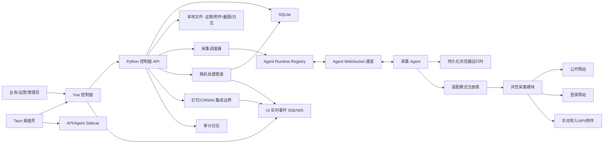
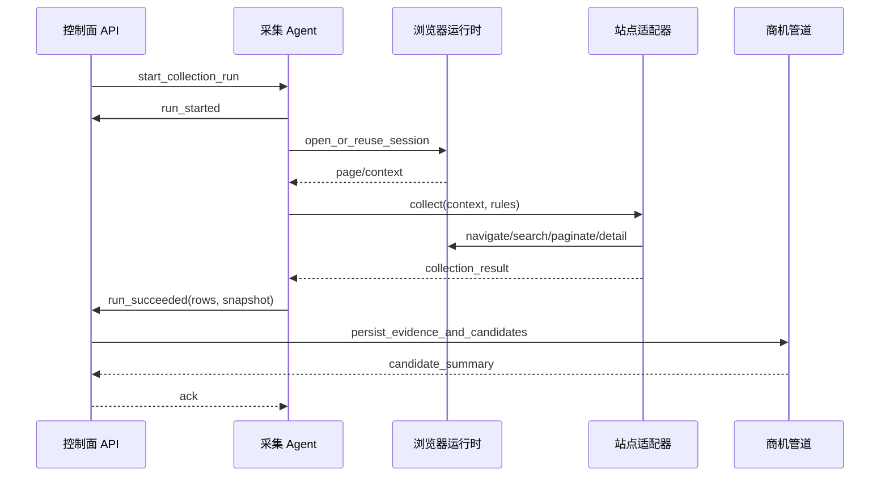
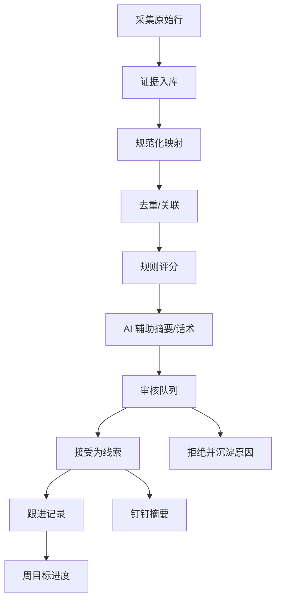
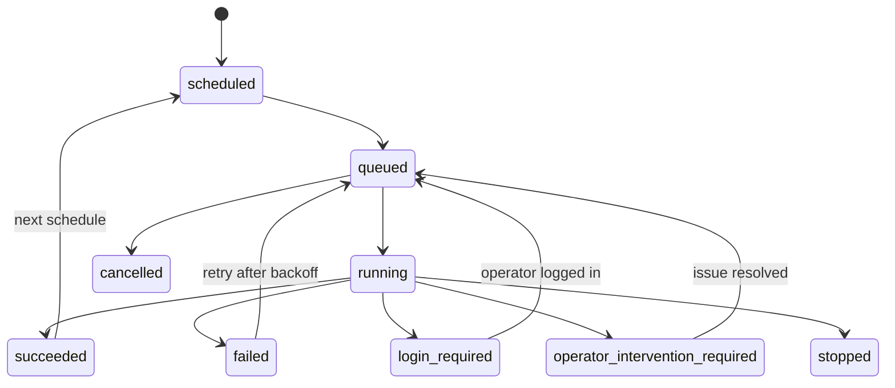

# 智能商机挖掘助手技术方案设计

## 1. 技术结论

本系统采用本地优先的前后端分离架构：Vue 控制面负责日常操作，Python 控制面 API 负责任务、数据、权限、审计和推送，Python 采集 Agent 负责浏览器会话和站点适配器执行，SQLite 和本地文件目录负责持久化，Tauri 作为后续桌面打包壳。

核心技术路线如下：

- 前端：Vue 3 + TypeScript + Vite + Vue Router + Pinia + Element Plus，构建成熟管理平台风格控制面。
- 后端：Python API 服务，采用 FastAPI 风格的 JSON API、WebSocket/SSE 实时事件和 Pydantic 数据契约。
- 采集：控制面和 Agent 分离，Agent 通过长连接注册、心跳、接收命令、上报采集事件。
- 浏览器：Agent 内部使用可持久化的浏览器运行时，支持无需登录网站和要求登录网站。
- 规则：采集规则分为两层，基础规则给业务用户表单化配置，高级规则给管理员配置适配模式、选择器、映射、限流和风险识别。
- 适配：不同站点通过 `adapter_mode` 选择适配模式，通过共性模块复用导航、检索、分页、解析、附件、风险和证据快照能力。
- 数据：Agent 不直接写业务库，只返回结构化事件；控制面统一完成证据入库、去重、评分、审核、推送和审计。
- 打包：首版先保证 Web/API/Agent 本地开发可运行，同时所有路径、端口和前端静态资源加载方式都为 Tauri sidecar 预留。

该文档是开发实施的技术设计，承接计划文档中的 9 个实施单元，重点定义模块边界、数据模型、协议、API、前端结构和运行约束。

## 2. 设计目标与边界

### 2.1 必须满足

- 支持公共网站采集和登录网站采集。
- 支持站点适配模式，不为每个站点重写完整采集流程。
- 支持业务可配置的基础采集规则和管理员可配置的高级采集规则。
- 支持来源目录、采集运行、证据、候选商机、审核、跟进、目标、钉钉、Agent、审计全流程。
- 支持 Vue 控制面通过 JSON API 和实时通道工作，不依赖 SSR。
- 支持后续 Tauri 本地打包，前端可作为静态资源加载，后端和 Agent 可作为 sidecar 进程运行。
- 支持从 `crawler-monitor` 复制可复用的运行时能力，但必须替换支付领域命名和业务语义。

### 2.2 首版不解决

- 不承诺一次性覆盖 Excel 中所有来源。
- 不实现绕过验证码、账号风控、robots 或站点访问限制的采集能力。
- 不把 AI 输出当成事实，不编造联系人、电话、预算等字段。
- 不在 CRM API 权限和字段归属确认前做自动写回。
- 不把 Tauri 生产安装包作为 MVP 的前置条件。

## 3. 总体架构



### 3.1 运行时职责

| 组件 | 技术形态 | 核心职责 | 不做什么 |
| --- | --- | --- | --- |
| Vue 控制面 | Vue 3 + TS + Vite | 页面、路由、表格、表单、审核、运行状态、规则配置 | 不直连 SQLite、不读本地密钥、不执行采集 |
| 控制面 API | Python JSON API | 鉴权、权限、数据校验、任务派发、入库、审计、推送 | 不持有浏览器页面对象 |
| Agent 通道 | WebSocket | Agent 注册、心跳、命令派发、事件上报 | 不承载大文件传输 |
| 采集 Agent | Python 进程 | 浏览器会话、站点适配器、登录态、采集执行 | 不直接写业务表 |
| 适配模式注册表 | Python 模块 | 根据来源配置选择采集模式和共性模块 | 不包含业务评分和审核逻辑 |
| 商机处理管道 | Python 服务 | 规范化、去重、评分、AI 辅助、审核状态初始化 | 不编造缺失事实 |
| SQLite | 本地数据库 | 结构化数据、状态、审计、配置版本 | 不存明文凭证 |
| 本地文件目录 | 应用数据目录 | 附件文本、诊断截图、原文快照、运行日志 | 不依赖源码路径 |
| Tauri | 桌面壳 | 加载前端静态资源，启动或连接本地 sidecar | 首版不承担业务逻辑 |

### 3.2 开发与桌面运行模式

开发模式：

- `frontend` 通过 Vite dev server 运行。
- 控制面 API 作为独立本地 Python 服务运行。
- Agent 作为独立本地 Python 进程运行，并连接控制面 WebSocket。
- 数据库、日志、浏览器用户数据目录从开发配置文件读取。

Tauri 模式：

- Vue 构建产物作为静态资源被 Tauri 加载。
- 控制面 API 和 Agent 可打包为 sidecar，或由 all-in-one sidecar 统一启动。
- Tauri 启动时执行健康检查：API 可用、数据库迁移完成、Agent 在线、浏览器运行时可用、数据目录可写。
- 数据库、日志、附件、截图、浏览器用户数据目录放在应用数据目录下，不依赖项目源码目录。

## 4. 代码模块设计

建议项目结构：

```text
.
├── docs/
│   ├── designs/
│   ├── plans/
│   └── runbooks/
├── frontend/
│   ├── src/
│   │   ├── api/
│   │   ├── components/
│   │   ├── layouts/
│   │   ├── pages/
│   │   ├── router/
│   │   ├── stores/
│   │   ├── styles/
│   │   └── tests/
│   ├── package.json
│   └── vite.config.ts
├── migrations/
│   └── versions/
├── packaging/
│   ├── defaults/
│   └── pyinstaller/
├── scripts/
├── src/
│   └── opportunity_crawler/
│       ├── agent/
│       │   ├── app.py
│       │   ├── browser/
│       │   ├── channel/
│       │   └── runtime/
│       ├── bootstrap/
│       ├── collection/
│       │   ├── actions/
│       │   ├── adapters/
│       │   ├── source_configs/
│       │   └── rules/
│       ├── control_plane/
│       │   ├── app.py
│       │   ├── routes/
│       │   ├── services/
│       │   └── workers/
│       ├── integrations/
│       └── shared/
│           ├── config.py
│           ├── contracts/
│           ├── db/
│           └── domain/
├── src-tauri/
└── tests/
```

### 4.1 复用 `crawler-monitor` 的边界

优先复制和改造运行框架，不复制支付业务逻辑。

| 参考能力 | 复制到本项目的目标模块 | 改造要求 |
| --- | --- | --- |
| Agent 协议 | `shared/contracts/agent_protocol.py` | 改为 collection command/event，字段围绕 source/run/item |
| WebSocket 客户端 | `agent/channel/websocket_client.py` | 改为采集 Agent 注册、心跳和命令消费 |
| Runtime Registry | `control_plane/services/runtime_registry.py` | 改为在线 Agent、来源任务派发和运行事件记录 |
| 浏览器运行时 | `agent/browser/camoufox_runtime.py` | 改为来源会话、登录态和应用数据路径 |
| 会话管理 | `agent/runtime/session_manager.py` | 改为 source account 单会话占用 |
| 人类化动作 | `collection/actions/humanized_actions.py` | 供所有复杂站点复用 |
| SQLite 迁移 | `shared/db/base.py` | 保留迁移机制，重建商机域模型 |
| 配置加载 | `shared/config.py` | 改为 `OPPORTUNITY_CRAWLER_*` 环境变量 |
| 打包脚本 | `packaging/pyinstaller/*` | 改为 API、Agent、all-in-one sidecar |

禁止在持久化表、API、前端页面和日志里保留 `alipay`、`trade_no`、`inspection`、`delivery` 等支付语义。

## 5. 领域数据模型

### 5.1 核心表

| 表 | 作用 | 关键字段 |
| --- | --- | --- |
| `sources` | 来源目录主表 | `id`, `name`, `category`, `home_url`, `priority`, `enabled`, `adapter_mode`, `login_mode`, `health_status`, `active_rule_version_id`, `last_success_at`, `last_failure_reason` |
| `source_basic_rules` | 业务基础规则 | `source_id`, `regions_json`, `industry_keywords_json`, `demand_keywords_json`, `exclude_keywords_json`, `frequency`, `digest_enabled`, `digest_score_threshold`, `updated_by` |
| `source_advanced_rule_versions` | 高级规则版本 | `source_id`, `version`, `status`, `adapter_mode`, `entry_url`, `login_mode`, `selectors_json`, `pagination_policy_json`, `normalization_mapping_json`, `risk_patterns_json`, `rate_limit_policy_json`, `created_by`, `activated_at` |
| `source_accounts` | 登录来源账号元数据 | `source_id`, `credential_profile_id`, `owner_user_id`, `login_status`, `last_login_at`, `session_profile_path`, `masked_account_name` |
| `agent_hosts` | Agent 主机 | `host_id`, `hostname`, `platform`, `app_version`, `last_seen_at` |
| `agent_instances` | Agent 在线实例 | `agent_id`, `host_id`, `status`, `capacity`, `active_sessions`, `last_heartbeat_at` |
| `collection_runs` | 单次采集运行 | `run_id`, `source_id`, `agent_id`, `rule_version`, `status`, `scheduled_at`, `started_at`, `finished_at`, `page_count`, `item_count`, `failure_kind`, `diagnostic_snapshot_json` |
| `raw_evidence_items` | 原始证据 | `id`, `run_id`, `source_id`, `source_item_key`, `url`, `title`, `published_at`, `raw_text`, `raw_html_path`, `attachments_json`, `content_fingerprint` |
| `opportunity_candidates` | 候选商机 | `id`, `source_id`, `evidence_id`, `dedupe_key`, `title`, `organization_name`, `region`, `industry`, `project_stage`, `budget_amount`, `score`, `priority_label`, `review_status`, `follow_up_status` |
| `candidate_analysis` | AI 与规则分析 | `candidate_id`, `extracted_facts_json`, `inferred_analysis_json`, `scoring_reasons_json`, `outreach_json`, `provider_metadata_json` |
| `customers` | 轻量客户档案 | `id`, `name`, `region`, `industry`, `crm_external_id`, `source`, `notes` |
| `customer_activities` | 跟进记录 | `customer_id`, `candidate_id`, `activity_type`, `content`, `occurred_at`, `created_by` |
| `weekly_goals` | 周目标 | `owner_user_id`, `week_start`, `visit_target`, `quote_target`, `opportunity_target` |
| `notification_logs` | 推送记录 | `channel`, `template`, `candidate_ids_json`, `status`, `sent_at`, `failure_reason` |
| `audit_logs` | 操作审计 | `actor_id`, `action`, `resource_type`, `resource_id`, `before_json`, `after_json`, `ip_address`, `created_at` |

### 5.2 关系和约束

- `sources.active_rule_version_id` 指向已激活的 `source_advanced_rule_versions`。
- 每次 `collection_runs` 必须记录当时使用的 `rule_version`，便于追踪规则变更导致的采集异常。
- `raw_evidence_items` 与 `opportunity_candidates` 分离，候选商机可以重算分数或变更审核状态，原始证据必须保留。
- `source_item_key` 在同一 `source_id` 下尽量唯一，无法稳定生成时使用 URL 和正文指纹辅助去重。
- `opportunity_candidates.dedupe_key` 由来源、URL、标题、组织、发布时间、内容指纹组合生成。
- 凭证只保存引用和脱敏名称，不在 SQLite 明文保存密码、Cookie、Token。
- 审计日志记录关键状态变化，但敏感字段在 `before_json` 和 `after_json` 中必须脱敏。

## 6. 两层采集规则设计

采集规则是自定义的，明确分为业务基础规则和技术高级规则两层。

### 6.1 基础规则

基础规则面向业务经理、运营人员和管理者，用表单配置，不暴露选择器、DOM、接口分页等技术细节。

可配置项：

- 来源启用/停用。
- 来源优先级。
- 地区范围。
- 行业关键词。
- 需求关键词。
- 排除关键词。
- 时间范围。
- 采集频率。
- 每日推送阈值。
- 是否进入钉钉摘要。

校验要求：

- 关键词数组去空、去重、限制长度。
- 频率只能从枚举中选择，如手动、每天、每周。
- 推送阈值必须在 0-100。
- 变更写审计日志。
- 基础规则更新不会创建高级规则版本。

### 6.2 高级规则

高级规则面向管理员和技术人员，用配置编辑器维护，并提供结构校验、试运行、版本历史和回滚。

可配置项：

- `adapter_mode`
- `entry_url`
- `login_mode`
- `selectors`
- `pagination_policy`
- `normalization_mapping`
- `attachment_policy`
- `risk_patterns`
- `rate_limit_policy`
- `retry_policy`

高级规则状态：

| 状态 | 含义 |
| --- | --- |
| `draft` | 草稿，可编辑，不参与正式采集 |
| `active` | 当前生效版本，采集运行使用该版本 |
| `archived` | 历史版本，不可直接编辑，可复制或回滚 |
| `failed_guarded` | 激活后连续失败，被系统建议回滚 |

保存流程：

1. 前端提交草稿配置。
2. 后端用 Pydantic 模型校验结构、枚举、必填字段和 URL。
3. 后端执行静态校验，如选择器字段是否齐全、分页策略是否有最大页数。
4. 管理员可发起试运行，试运行只返回预览行、证据片段和诊断快照，不入库、不推送。
5. 管理员确认后激活新版本。
6. 后端更新 `sources.active_rule_version_id` 并写审计日志。

## 7. 站点适配架构

### 7.1 适配模式

| 模式 | 适用来源 | 关键流程 |
| --- | --- | --- |
| `public_search_list_detail` | 政府采购、公共资源、招投标平台 | 打开入口页，构造检索，采集列表，翻页，进入详情，抽取正文和附件 |
| `public_channel_news` | 政府部门、行业媒体、华为栏目 | 打开栏目，按日期和关键词过滤，采集文章详情 |
| `login_search_list_detail` | 建设网、企业数据平台、账号型平台 | 复用登录会话，确认登录态，低频采集，异常时上报人工处理 |
| `spa_or_ajax_search` | 前端渲染较重站点 | 等待页面稳定，触发检索，等待 DOM 或接口结果，抽取渲染结果 |
| `attachment_document` | PDF、Word、Excel 附件 | 下载或打开附件，提取文本，关联原公告 |
| `manual_import` | 微信公众号、临时人工来源 | 人工粘贴链接或正文，统一证据化、规范化、评分 |
| `api_or_feed` | RSS、公开 API、结构化接口 | 调接口，解析分页，映射字段 |

### 7.2 共性模块

| 模块 | 输入 | 输出 | 说明 |
| --- | --- | --- | --- |
| `rules.loader` | 来源 ID、规则版本 | 基础规则、高级规则 | 统一读取和合并规则 |
| `session.manager` | 来源、登录模式 | 页面或上下文句柄 | 公共来源临时会话，登录来源持久会话 |
| `actions.humanized` | 页面、动作参数 | 动作结果 | 点击、输入、滚动、等待、随机停顿 |
| `query_profiles` | 基础规则、客户画像 | 查询组合 | 生成关键词、地区、日期范围 |
| `pagination` | 页面、分页规则 | 页结果、停止原因 | 防止死循环，记录最大页数、空结果等 |
| `parsing` | HTML/DOM、选择器 | 列表项、详情字段 | 输出统一中间结构 |
| `attachments` | 附件 URL、文件类型 | 文本和元数据 | 失败不阻断主流程 |
| `risk` | 页面文本、状态码、截图 | 风险分类 | 登录失效、验证码、风控、改版、空结果 |
| `evidence` | 原文、字段、快照 | 证据对象 | 保存可审计依据 |
| `normalization` | 证据对象、映射 | 候选项输入 | 对齐候选商机字段 |

### 7.3 采集执行流程



失败流程：

- 网络、超时、临时页面错误：`run_failed`，可退避重试。
- 选择器缺失或页面改版：`run_failed(parse_failed)`，保留诊断快照。
- 登录失效：`login_required`，停止自动重试，提醒维护人。
- 验证码或风控：`operator_intervention_required`，停止自动重试。
- 单条详情失败：记录 item-level failure，整轮可继续。

## 8. Agent 协议设计

### 8.1 连接与身份

Agent 启动后连接控制面 WebSocket：

- 上报 `agent_id`、`host_id`、`hostname`、`platform`、`app_version`、`capacity`。
- 控制面登记在线状态并返回注册结果。
- Agent 按固定间隔发送 heartbeat。
- 控制面在心跳超时后标记 Agent 离线，并让待执行命令失败或重新调度。

### 8.2 控制面命令

| 命令 | 作用 | 关键字段 |
| --- | --- | --- |
| `start_collection_run` | 启动一次来源采集 | `command_id`, `run_id`, `source_id`, `rule_version`, `adapter_mode`, `login_mode`, `deadline_at` |
| `stop_collection_run` | 停止运行中的采集 | `command_id`, `run_id`, `reason` |
| `open_source_session` | 打开登录来源会话 | `command_id`, `source_id`, `source_account_id`, `entry_url` |
| `release_source_session` | 释放来源会话 | `command_id`, `source_account_id`, `reason` |
| `trial_run_advanced_rule` | 高级规则试运行 | `command_id`, `source_id`, `draft_rule_payload`, `max_items` |
| `health_check` | 检查 Agent 和浏览器可用性 | `command_id` |

### 8.3 Agent 事件

| 事件 | 含义 | 是否影响来源健康 |
| --- | --- | --- |
| `registered` | Agent 注册成功 | 是 |
| `heartbeat` | Agent 在线心跳 | 是 |
| `run_started` | 采集开始 | 是 |
| `page_opened` | 页面打开成功 | 可选 |
| `query_submitted` | 检索提交成功 | 可选 |
| `page_collected` | 一页列表或详情采集完成 | 可选 |
| `item_failed` | 单条详情失败 | 可选 |
| `run_succeeded` | 采集成功 | 是 |
| `run_failed` | 采集失败 | 是 |
| `login_required` | 需要重新登录 | 是 |
| `operator_intervention_required` | 需要人工处理 | 是 |
| `run_stopped` | 采集被停止 | 是 |
| `trial_run_completed` | 高级规则试运行完成 | 否 |

事件公共字段：

```json
{
  "event_id": "uuid",
  "type": "run_succeeded",
  "agent_id": "agent-local-1",
  "source_id": 1,
  "run_id": "uuid",
  "occurred_at": "2026-04-24T09:00:00+08:00",
  "payload": {}
}
```

`payload` 中允许放候选原始行、页数、条数、失败分类、截图路径、页面标题、当前 URL、分页停止原因等诊断信息，但不允许放明文凭证。

## 9. 控制面 API 设计

API 统一返回 JSON，错误统一使用结构化错误：

```json
{
  "error": {
    "code": "validation_error",
    "message": "高级规则配置无效",
    "details": []
  }
}
```

### 9.1 来源与规则

| 方法 | 路径 | 作用 |
| --- | --- | --- |
| `GET` | `/api/sources` | 来源列表，含健康、登录、调度和规则摘要 |
| `POST` | `/api/sources` | 新增来源 |
| `GET` | `/api/sources/{id}` | 来源详情 |
| `PATCH` | `/api/sources/{id}` | 更新来源基础信息 |
| `PATCH` | `/api/sources/{id}/basic-rules` | 更新基础规则 |
| `GET` | `/api/sources/{id}/advanced-rules` | 高级规则版本列表 |
| `POST` | `/api/sources/{id}/advanced-rules` | 创建高级规则草稿 |
| `POST` | `/api/sources/{id}/advanced-rules/{version}/trial-run` | 试运行高级规则 |
| `POST` | `/api/sources/{id}/advanced-rules/{version}/activate` | 激活高级规则版本 |
| `POST` | `/api/sources/{id}/advanced-rules/{version}/rollback` | 回滚到指定版本 |

### 9.2 采集运行

| 方法 | 路径 | 作用 |
| --- | --- | --- |
| `GET` | `/api/collection-runs` | 采集运行列表 |
| `GET` | `/api/collection-runs/{run_id}` | 运行详情、事件、诊断快照 |
| `POST` | `/api/sources/{id}/collection-runs` | 手动触发采集 |
| `POST` | `/api/collection-runs/{run_id}/stop` | 停止采集 |
| `GET` | `/api/collection-runs/{run_id}/evidence` | 查看本轮证据 |

### 9.3 商机、客户、目标和推送

| 方法 | 路径 | 作用 |
| --- | --- | --- |
| `GET` | `/api/opportunities` | 候选商机列表 |
| `GET` | `/api/opportunities/{id}` | 商机详情 |
| `POST` | `/api/opportunities/manual-import` | 手动导入候选来源 |
| `POST` | `/api/opportunities/{id}/review` | 接受、拒绝、退回 |
| `PATCH` | `/api/opportunities/{id}/follow-up` | 更新跟进状态 |
| `POST` | `/api/opportunities/{id}/outreach` | 生成或刷新话术 |
| `GET` | `/api/customers` | 客户列表 |
| `GET` | `/api/customers/{id}` | 客户详情和历史 |
| `GET` | `/api/goals/current-week` | 本周目标和完成情况 |
| `PATCH` | `/api/goals/current-week` | 更新本周目标 |
| `POST` | `/api/notifications/dingtalk/test` | 钉钉测试推送 |
| `POST` | `/api/notifications/dingtalk/daily-digest` | 手动生成每日摘要 |
| `GET` | `/api/notifications/logs` | 推送日志 |

### 9.4 运行时、审计和健康

| 方法 | 路径 | 作用 |
| --- | --- | --- |
| `GET` | `/api/agents` | Agent 在线状态 |
| `POST` | `/api/agents/{agent_id}/health-check` | Agent 健康检查 |
| `POST` | `/api/sources/{id}/sessions/open` | 打开登录来源会话 |
| `POST` | `/api/sources/{id}/sessions/release` | 释放登录来源会话 |
| `GET` | `/api/audit-logs` | 审计日志 |
| `GET` | `/api/events` | UI SSE 事件流 |
| `GET` | `/api/health` | API、DB、迁移、Agent、浏览器依赖健康 |

## 10. 商机处理管道



处理原则：

- 证据先入库，候选商机后生成。
- 去重不直接丢弃项目阶段变化，采购意向、招标公告、中标公告可以建立关联。
- 评分先用确定性规则，AI 只做摘要、建议和可解释补充。
- AI 服务必须可关闭，关闭后系统仍可从采集到审核闭环。
- 联系人、电话、预算缺失时保持空，不由 AI 生成。
- 钉钉失败只影响推送日志，不回滚候选商机和审核状态。

评分维度首版固定为：

| 维度 | 权重 |
| --- | ---: |
| 地区匹配 | 25 |
| 行业/客户类型匹配 | 20 |
| 项目阶段匹配 | 15 |
| 需求关键词命中 | 20 |
| 规模/预算匹配 | 15 |
| 来源优先级 | 5 |

## 11. Vue 控制面技术设计

### 11.1 前端栈

- Vue 3 Composition API。
- TypeScript。
- Vite。
- Vue Router。
- Pinia。
- Element Plus 作为管理平台组件基础。
- `@element-plus/icons-vue` 用于常见操作图标。
- ECharts 或轻量图表库用于仪表盘和目标进度。
- Vitest + Vue Test Utils 做组件和 store 测试。

### 11.2 页面结构

| 页面 | 目标 |
| --- | --- |
| 仪表盘 | 今日新增、高分候选、待审核、失败运行、Agent 在线、本周目标 |
| 来源管理 | 来源列表、健康状态、登录状态、基础规则、高级规则、试运行和回滚 |
| 采集运行 | 运行历史、事件时间线、失败原因、诊断快照 |
| 审核队列 | 快速筛选、接受、拒绝、备注、原文查看 |
| 商机详情 | 证据优先展示事实、推断、评分原因、跟进记录和话术 |
| 客户档案 | 客户聚合、历史商机、拜访和报价记录 |
| 周目标 | 目标录入、完成率、滞后提醒 |
| 钉钉推送 | 推送配置、模板、测试和推送日志 |
| Agent 管理 | 在线状态、容量、心跳、浏览器依赖和会话 |
| 审计日志 | 操作、角色、资源、前后变化和敏感访问记录 |

### 11.3 管理平台样式标准

- 左侧导航、顶部状态区、主内容区。
- 页面不做营销页、首屏大 Hero、装饰性渐变或大面积单色主题。
- 表格密度适中，支持筛选、排序、固定操作列和长文本省略。
- 状态标签使用稳定业务色：成功、警告、失败、登录失效、高优先级、待处理。
- 来源和商机详情使用抽屉或详情页，不在列表里堆叠过多信息。
- 高级规则编辑器使用分区表单和 JSON/结构化配置混合编辑，必须有校验提示和试运行预览。
- 所有页面必须覆盖加载、空状态、错误、无权限、实时断线、登录失效和人工处理状态。
- 桌面浏览器和 Tauri 常用窗口宽度下不能出现文字重叠、按钮挤压和不可控横向滚动。

### 11.4 前端数据流

- `api/client.ts` 统一处理 base URL、认证、错误、超时。
- `api/events.ts` 统一管理 SSE/WS 连接和重连。
- `stores/runtime.ts` 保存 Agent、事件流、系统健康。
- `stores/sources.ts` 保存来源、基础规则、高级规则状态。
- `stores/opportunities.ts` 保存审核队列、详情、跟进操作。
- 页面组件只调用 store 或 API composable，不直接拼接底层 fetch。

Tauri 兼容约束：

- API base URL 不写死同源，可通过 `VITE_API_BASE_URL` 和运行时配置覆盖。
- WebSocket/SSE URL 单独配置。
- 前端不读取本地文件路径，证据文件通过后端授权接口访问。
- 前端不包含任何密钥，Vite 只暴露非敏感 `VITE_*` 配置。

## 12. 登录来源与会话安全

登录来源状态：

| 状态 | 含义 | 系统动作 |
| --- | --- | --- |
| `not_required` | 无需登录 | 可自动采集 |
| `pending_login` | 待人工登录 | 不自动采集，提示维护人 |
| `logged_in` | 会话可用 | 允许低频采集 |
| `expired` | 登录失效 | 停止重试，提示重新登录 |
| `operator_required` | 验证码、风控或账号异常 | 停止重试，要求人工处理 |

安全要求：

- 同一 `source_account_id` 同一时间只能被一个 Agent 会话占用。
- 浏览器用户数据目录按来源账号隔离。
- 账号、Cookie、Token、密码不写普通日志、不进入钉钉、不返回前端。
- 操作员打开登录会话、释放会话、查看敏感字段都写审计日志。
- 登录类来源默认低频执行，失败后不做激进重试。

## 13. 调度与失败处理

调度器输入：

- 来源启用状态。
- 来源优先级。
- 基础规则频率。
- 登录状态。
- 最近成功/失败时间。
- 连续失败次数。
- 高级规则版本状态。
- Agent 在线容量。

运行状态机：



失败分类：

| 分类 | 是否重试 | UI 展示 |
| --- | --- | --- |
| `network_timeout` | 是，退避 | 临时网络异常 |
| `http_error` | 是，有限重试 | 页面访问失败 |
| `parse_failed` | 否或低频 | 疑似页面改版 |
| `empty_result` | 否，算成功 | 本轮无结果 |
| `login_required` | 否 | 登录失效 |
| `captcha_or_risk` | 否 | 需要人工处理 |
| `adapter_config_invalid` | 否 | 高级规则错误 |
| `agent_offline` | 是，换 Agent 或等待 | Agent 离线 |

## 14. 安全、权限与审计

角色：

- 操作员：维护来源和登录会话，查看采集健康。
- 业务经理：审核商机、生成话术、记录跟进。
- 管理者：查看统计、目标、转化和推送效果。
- 管理员：管理高级规则、用户权限、凭证、钉钉和 CRM。

权限边界：

- 基础规则可由业务和运营角色修改。
- 高级规则只能由管理员修改、试运行、激活和回滚。
- 敏感字段按角色脱敏，后端负责最终脱敏。
- 导出、查看敏感详情、推送、CRM 操作必须审计。
- API 错误不能泄露本地路径、凭证、Cookie 或完整页面敏感文本。

## 15. Tauri 打包技术约束

Tauri 首版作为打包目标预留，不阻塞 Web/API/Agent MVP。

打包边界：

- `frontend/dist` 作为 Tauri 静态资源。
- `control_plane`、`agent` 或 `all_in_one` 作为 sidecar 候选。
- sidecar 启动参数传入配置路径、数据目录、日志目录、端口和浏览器数据目录。
- Tauri capability 只允许启动命名 sidecar，不开放任意 shell 执行。

本地目录：

| 目录 | 用途 |
| --- | --- |
| `app_data/db` | SQLite |
| `app_data/logs` | 运行日志 |
| `app_data/evidence` | 原文快照、附件文本 |
| `app_data/screenshots` | 诊断截图 |
| `app_data/browser-profiles` | 登录来源浏览器用户数据 |
| `app_data/tmp` | 临时下载和解析 |

启动检查：

- 数据库目录可写。
- 迁移已完成。
- API 端口可用。
- Agent 已注册或正在启动。
- 浏览器依赖可用。
- 钉钉和 CRM 凭证缺失时给出可操作提示，但不阻塞核心采集和审核。

## 16. 测试策略

| 层级 | 覆盖重点 |
| --- | --- |
| 单元测试 | 配置、规则校验、去重、评分、协议序列化、风险识别、分页停止 |
| 集成测试 | 迁移、API、Agent 注册、命令派发、采集事件入库、候选生成 |
| Fixture 测试 | 静态 HTML 列表/详情解析、高级规则试运行、附件文本处理 |
| 前端测试 | API client、store、审核队列、来源规则表单、事件重连 |
| E2E 测试 | 手动导入到审核、采集运行到候选入库、接受线索到目标和推送日志 |
| 视觉验证 | 仪表盘、来源管理、审核队列、商机详情在桌面和 Tauri 尺寸下无重叠 |
| 打包烟测 | sidecar 启动、健康检查、Agent 注册、静态前端加载 |

关键测试准则：

- 适配器先用 fixture 测试，再接真实站点。
- AI 和钉钉必须可 mock，不让外部服务阻塞核心测试。
- 登录来源必须测试 `login_required` 不阻塞公共来源采集。
- 配置和 API 序列化测试要防止支付领域命名泄漏。

## 17. 实施顺序映射

| 计划单元 | 技术重点 |
| --- | --- |
| Unit 1 | 项目骨架、配置、迁移、开发启动脚本 |
| Unit 2 | 数据模型、来源种子、规则版本、候选商机模型 |
| Unit 3 | JSON API、Runtime Registry、UI 事件和审计 |
| Unit 4 | Agent 协议、浏览器运行时、会话占用和命令执行 |
| Unit 5 | 适配模式、共性采集模块、P0 公共来源和手动导入 |
| Unit 6 | 规范化、去重、评分、AI 边界、审核、目标、钉钉 |
| Unit 7 | Vue 管理平台控制面 |
| Unit 8 | Tauri 和本地打包契约 |
| Unit 9 | 操作手册、适配器指南、E2E 和发布检查 |

## 18. 待确认技术问题

- 首批 3-5 个 P0 来源的真实页面路径、检索参数、选择器和分页规则。
- DingTalk 使用群机器人还是企业应用推送。
- AI 使用本地模型、内网模型还是外部模型，以及敏感字段过滤策略。
- CRM 初期导入格式和后续只读 API 权限。
- PDF、Word、Excel 附件解析库选择。
- Tauri 最终采用独立 API/Agent sidecar 还是 all-in-one sidecar。

这些问题不阻塞当前架构设计，但会影响 Unit 5、Unit 6 和 Unit 8 的具体实现细节。
