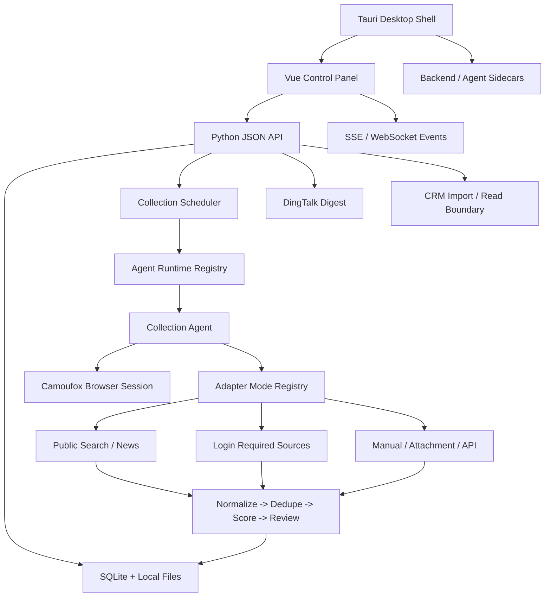
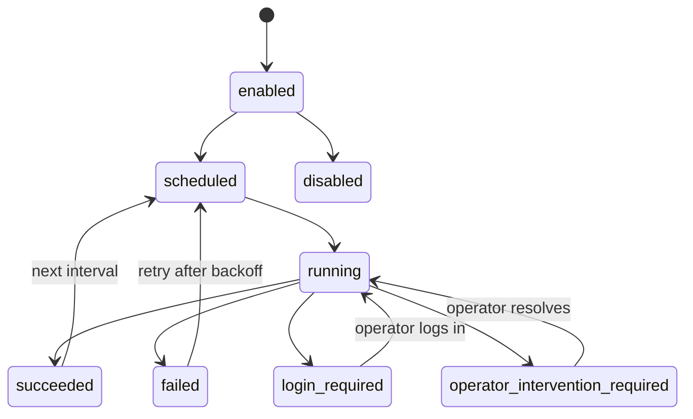
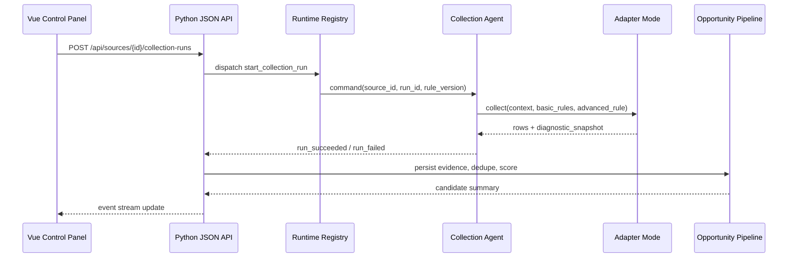
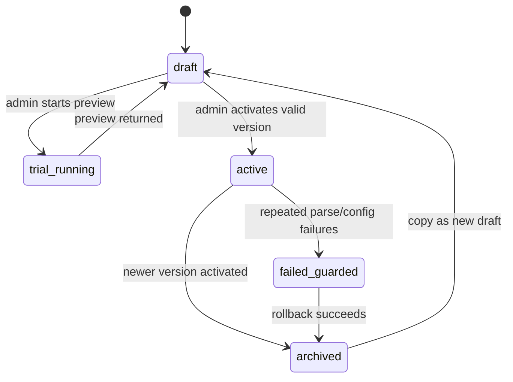

# feat: Build Smart Opportunity Crawler Platform

## Overview

Build a local-first smart opportunity crawler platform with a Vue control panel, Python API backend, browser-backed collection Agent, configurable site adapter modes, auditable opportunity processing, DingTalk notifications, and Tauri packaging readiness.

The implementation should reuse proven patterns from the reference `crawler-monitor` project where they fit: Agent registration and heartbeat, WebSocket command flow, Camoufox browser sessions, session conflict handling, migrations, settings loading, audit logging, and local packaging shape. It must replace payment-monitoring terminology with opportunity-domain concepts and avoid carrying over Alipay, trade, or delivery semantics.

This deepened plan incorporates the technical design in `docs/designs/2026-04-24-001-smart-opportunity-crawler-technical-design.md`: explicit two-layer collection rules, versioned advanced rule lifecycle, source/session data model, Agent command/event names, structured JSON API surfaces, Element Plus-based management UI, and Tauri sidecar capability constraints.

## Problem Frame

Business users need a daily workflow that turns public and login-protected online sources into reviewable, scored, and follow-up-ready sales opportunities. The system must support the source catalog and customer profile from the origin document, while keeping evidence auditable and separating extracted facts from AI inference.

The target repo is currently a greenfield workspace with the design document and IDE metadata only. This plan therefore creates the project skeleton, backend, frontend, Agent runtime, data model, adapter framework, local packaging shape, and the first MVP flows.

## Requirements Trace

- R1. Maintain a configurable source catalog seeded from the spreadsheet-derived source list, including priority, login mode, adapter mode, region relevance, status, maintenance fields, and two-layer collection rules.
- R2. Support scheduled collection for both no-login public sites and login-required sites with retained browser sessions.
- R3. Provide adapter modes for different site shapes and extract shared common collection modules rather than duplicating full collectors per site.
- R4. Preserve raw evidence, extracted facts, inferred analysis, source links, attachments, and diagnostic snapshots for auditability.
- R5. Normalize, dedupe, score, rank, and review opportunity candidates against the target profile.
- R6. Provide Vue front-end control panel backed only by JSON APIs and real-time event channels.
- R7. Provide pages for dashboard, sources, collection runs, review queue, opportunity details, customers, goals, notifications, agents, and audit logs using a polished management-platform style.
- R8. Push a daily DingTalk digest for high-priority opportunities and preserve notification logs.
- R9. Provide lightweight CRM import/read integration boundaries without making CRM writeback a blocker.
- R10. Support local deployment, secure credential handling, role-aware access, sensitive-data masking, and operation logs.
- R11. Keep Tauri packaging viable by designing the Vue app as static assets and the Python backend/Agent as local sidecar-style processes.
- R12. Reuse reference project functionality by copying and adapting useful modules, but rename domain concepts to source accounts, collection runs, opportunity candidates, source item keys, and notifications.

## Scope Boundaries

- The MVP does not crawl every listed source; it targets the first 3-5 P0 public sources plus manual import scaffolding.
- The MVP does not perform fully autonomous outreach or CRM writeback.
- The MVP does not deep-crawl enterprise data platforms before login/session and access rules are stable.
- The MVP does not use SSR for the control panel; the front end is Vue + API only.
- The MVP does not rely on AI output as fact. Missing contacts remain empty.
- The MVP does not bypass CAPTCHA, robots restrictions, account risk controls, or site access limitations.

### Deferred to Separate Tasks

- CRM writeback: separate task after Xiaobangbang API auth, field ownership, and write permissions are confirmed.
- Additional source coverage: separate tasks per adapter/source family after the P0 collection loop is stable.
- Tauri production installer polish: separate packaging hardening after the web/API/Agent MVP is working locally.

## Context & Research

### Relevant Code and Patterns

- Current repo has no application code yet; it should be treated as greenfield.
- The technical design in `docs/designs/2026-04-24-001-smart-opportunity-crawler-technical-design.md` is now the primary implementation blueprint for module boundaries, API surfaces, rule lifecycle, and Tauri packaging constraints.
- Reference repo `crawler-monitor` uses Python 3.11+, FastAPI, Pydantic 2, SQLite, Camoufox, websockets, pytest, PyInstaller, pnpm, and Tailwind.
- Reference repo paths are relative to the reference repo:
  - `src/crawler_monitor/shared/contracts/agent_protocol.py` shows typed Pydantic command/event contracts and parse helpers.
  - `src/crawler_monitor/agent/channel/websocket_client.py` shows Agent registration, reconnect, heartbeat, command consumption, and event sending.
  - `src/crawler_monitor/control_plane/services/runtime_registry.py` shows online Agent presence, command dispatch, runtime event recording, and audit logging.
  - `src/crawler_monitor/agent/browser/camoufox_runtime.py` shows persistent browser context creation, session handles, keep-alive checks, and state clearing.
  - `src/crawler_monitor/agent/runtime/session_manager.py` shows single-account session ownership and conflict prevention.
  - `src/crawler_monitor/agent/site_adapters/humanized_actions.py` shows reusable page interaction helpers.
  - `src/crawler_monitor/shared/db/base.py` shows simple migration discovery, SQLite connection setup, WAL mode, and foreign keys.
  - `src/crawler_monitor/shared/config.py` shows TOML settings plus environment overrides with stable validation errors.
  - `migrations/versions/20260424_001_opportunity_mining_mvp.py` seeds the opportunity source catalog and a small candidate model.
  - `tests/integration/test_opportunity_mvp.py`, `tests/unit/test_websocket_client.py`, `tests/unit/test_camoufox_runtime.py`, and `tests/unit/test_config.py` show useful testing patterns.

### Institutional Learnings

- No `docs/solutions/` directory exists in the current or reference repo, so there are no recorded institutional learnings to apply.

### External References

- Vue official docs recommend Vite-powered `create-vue` scaffolding and state that Vue has first-class TypeScript support; use `vue-tsc` or equivalent type checking because Vite transpilation does not type-check Vue SFCs by itself.
- Vite official docs state only `VITE_*` env variables are exposed to client code and warn that exposed values are bundled into the client; frontend config must never contain secrets.
- FastAPI official docs support WebSocket endpoints for backend-to-frontend or Agent communication, fitting the Agent registration and runtime event channel.
- Pydantic v2 docs define typed models as validation and JSON schema boundaries; use Pydantic contracts for API payloads and Agent command/event envelopes.
- Tauri official docs describe bundling external binaries as sidecars and requiring explicit shell capabilities for sidecar execution; packaging tests should verify named sidecars only, not arbitrary shell access.

## Key Technical Decisions

- Use a Python API backend with FastAPI-style patterns: This matches the reference project and keeps Agent/API contracts in one language.
- Use Vue 3 + TypeScript + Vite for the control panel: This matches the origin decision for front-end separation and keeps Tauri static asset packaging straightforward.
- Use Element Plus as the management-platform component baseline: This gives tables, forms, drawers, dialogs, status tags, and icons needed for a polished control panel without inventing a design system.
- Keep backend APIs JSON-only and real-time events over WebSocket or SSE: This prevents accidental SSR coupling and supports browser and Tauri shells.
- Use Pydantic v2 schemas at every API and Agent protocol boundary: This gives deterministic validation, structured errors, and JSON-compatible contract tests before Vue and Agent integration.
- Use SQLite for MVP persistence: Local deployment, low concurrency, and reference migration patterns fit the product constraints.
- Copy and adapt reference modules rather than import from the reference repo: This avoids cross-repo runtime coupling and allows domain-accurate naming.
- Rename runtime concepts before implementation: `account` becomes `source_account`, `inspection` becomes `collection_run`, `trade_no` becomes `source_item_key` or `dedupe_key`, and `delivery` becomes `notification`.
- Model site differences as adapter modes plus configuration: This avoids one bespoke crawler per site and supports no-login, login-required, AJAX, attachment, API/feed, and manual import sources.
- Split collection rules into two layers: business users can edit basic recall and scheduling rules, while administrators/technical users edit advanced adapter/selectors/mapping/risk rules with validation, trial runs, versioning, and rollback.
- Store raw evidence separately from normalized candidates: This preserves auditability and allows rescoring, dedupe tuning, and review status changes without mutating source evidence.
- Treat AI providers as an interface with a deterministic fallback: Planning can define the boundary before the exact provider is selected.
- Design Tauri as a packaging target from day one, not as the initial runtime dependency: The MVP can run web/API/Agent locally while preserving sidecar, app data directory, and restricted capability requirements.

## Open Questions

### Resolved During Planning

- Should the control panel use SSR or Vue? Resolution: Vue front end with JSON API backend; SSR is not used.
- Should login-required sources be excluded from architecture? Resolution: The architecture supports them through retained browser sessions and low-frequency collection, but MVP source count can focus on public P0 sources first.
- Should reference code be reused? Resolution: Copy and adapt reusable infrastructure modules into this repo with domain-specific names.

### Deferred to Implementation

- Exact selectors and request flows for each P0 source: These depend on source-by-source inspection during adapter implementation.
- DingTalk robot vs enterprise application mode: This depends on credentials and recipient setup.
- Xiaobangbang CRM API details: This depends on API access and field ownership confirmation.
- AI provider/runtime: This depends on local deployment and data protection choices; keep an interface and fallback.
- PDF/Office text extraction library choice: Decide during implementation based on dependency footprint and source attachment samples.
- Tauri sidecar topology: Decide after Unit 8 smoke tests whether production packaging uses separate API and Agent sidecars or a single all-in-one sidecar.

## Output Structure

This tree is the expected project shape. The implementer may adjust details as implementation reveals better boundaries, but the layer separation should remain.

```text
.
├── docs/
│   ├── designs/
│   ├── plans/
│   └── runbooks/
├── frontend/
│   ├── package.json
│   ├── vite.config.ts
│   ├── tsconfig.json
│   └── src/
│       ├── api/
│       ├── components/
│       ├── layouts/
│       ├── pages/
│       ├── styles/
│       ├── stores/
│       ├── router/
│       └── tests/
├── migrations/
│   └── versions/
├── packaging/
│   ├── defaults/
│   └── pyinstaller/
├── scripts/
├── src/
│   └── opportunity_crawler/
│       ├── agent/
│       ├── bootstrap/
│       ├── collection/
│       │   ├── actions/
│       │   ├── adapters/
│       │   ├── rules/
│       │   └── source_configs/
│       ├── control_plane/
│       ├── integrations/
│       └── shared/
├── src-tauri/
│   ├── capabilities/
│   ├── src/
│   └── tauri.conf.json
└── tests/
    ├── unit/
    ├── integration/
    ├── smoke/
    └── e2e/
```

## High-Level Technical Design

> *This illustrates the intended approach and is directional guidance for review, not implementation specification. The implementing agent should treat it as context, not code to reproduce.*









## Implementation Units

- [x] **Unit 1: Project Scaffold And Shared Configuration**

**Goal:** Establish the greenfield Python/Node/Tauri-ready repository foundation.

**Requirements:** R6, R10, R11, R12

**Dependencies:** None

**Files:**
- Create: `pyproject.toml`
- Create: `package.json`
- Create: `frontend/package.json`
- Create: `frontend/vite.config.ts`
- Create: `frontend/tsconfig.json`
- Create: `frontend/src/vite-env.d.ts`
- Create: `src/opportunity_crawler/__init__.py`
- Create: `src/opportunity_crawler/shared/config.py`
- Create: `src/opportunity_crawler/shared/db/base.py`
- Create: `packaging/defaults/control_plane.toml`
- Create: `packaging/defaults/agent.toml`
- Create: `packaging/defaults/all_in_one.toml`
- Create: `scripts/start_dev.sh`
- Create: `scripts/run_control_plane_dev.py`
- Create: `scripts/run_agent_dev.py`
- Test: `tests/unit/test_config.py`
- Test: `tests/unit/test_db_base.py`
- Test: `tests/unit/test_dev_scripts.py`

**Approach:**
- Copy the reference settings and migration approach conceptually, renaming environment variables and package paths to `OPPORTUNITY_CRAWLER_*`.
- Keep configuration paths explicit for database, logs, temp files, evidence files, screenshots, browser user data, frontend asset serving, and control-plane base URL.
- Set up backend and frontend manifests separately so the API and Vue control panel can evolve independently.
- Add Vue/Vite dependencies for Vue Router, Pinia, Element Plus, Element Plus icons, Vitest, Vue Test Utils, and `vue-tsc`.
- Type only non-secret frontend environment values such as `VITE_API_BASE_URL` and `VITE_EVENT_STREAM_URL`; do not define any secret-like `VITE_*` values.
- Ensure default paths can later be redirected to Tauri app data directories.

**Execution note:** Implement configuration and migration behavior test-first because these paths will be used by every later unit.

**Patterns to follow:**
- Reference repo `src/crawler_monitor/shared/config.py`
- Reference repo `src/crawler_monitor/shared/db/base.py`
- Reference repo `tests/unit/test_config.py`

**Test scenarios:**
- Happy path: TOML config with control-plane settings plus environment port override loads into typed settings.
- Happy path: Typed app data paths include database, logs, evidence, screenshots, browser profiles, and temp directories.
- Happy path: SQLite connection creates parent directory, enables foreign keys, and uses WAL mode.
- Happy path: Frontend env typings expose API/event URLs while keeping secrets out of Vite-visible config.
- Error path: Invalid integer environment override returns a stable structured config error.
- Error path: Missing required Agent settings returns stable field-specific errors.
- Error path: Secret-like frontend environment variables are documented as unsupported and not required by the app shell.
- Integration: Running migration discovery on an empty migration directory creates and preserves `schema_migrations`.
- Verification: Dev scripts reference the new package/module names and do not reference the reference project package.

**Verification:**
- Backend package imports from `src/opportunity_crawler`.
- Config tests prove TOML and environment overrides work.
- Frontend manifest can support static Vite builds, type checking, and UI tests without leaking secrets.
- Migration helper can apply an empty migration set safely.

- [x] **Unit 2: Domain Data Model And Migrations**

**Goal:** Create the local data model for local users, roles, sources, login credentials metadata, collection runs, raw evidence, opportunity candidates, customers, follow-ups, goals, notifications, agents, hosts, and audit logs.

**Requirements:** R1, R4, R5, R8, R9, R10

**Dependencies:** Unit 1

**Files:**
- Create: `migrations/versions/20260424_001_initial_schema.py`
- Create: `src/opportunity_crawler/shared/domain/source.py`
- Create: `src/opportunity_crawler/shared/domain/rules.py`
- Create: `src/opportunity_crawler/shared/domain/identity.py`
- Create: `src/opportunity_crawler/shared/domain/opportunity.py`
- Create: `src/opportunity_crawler/shared/domain/runtime.py`
- Create: `src/opportunity_crawler/shared/domain/audit.py`
- Create: `src/opportunity_crawler/shared/db/models.py`
- Test: `tests/integration/test_schema_constraints.py`
- Test: `tests/integration/test_source_catalog_seed.py`
- Test: `tests/integration/test_identity_role_seed.py`
- Test: `tests/unit/test_source_rule_versions.py`
- Test: `tests/unit/test_opportunity_scoring.py`
- Test: `tests/unit/test_audit_payloads.py`

**Approach:**
- Start from the reference opportunity migration seed, then expand it into the full source and collection model.
- Include source fields for `adapter_mode`, `login_mode`, `login_status`, `config_version`, `enabled`, scheduling, health, maintenance owner, and failure reason.
- Store `source_basic_rules` separately from `source_advanced_rule_versions` so permissions, validation, versioning, and UI treatment can differ.
- Model advanced rule states as `draft`, `active`, `archived`, and `failed_guarded`; only one active version should exist per source.
- Version advanced rule configurations and record the active rule version used by every collection run.
- Store source account metadata and secret references, not raw passwords or tokens.
- Add local identity tables for users, roles, role assignments, and API sessions or tokens so role-aware endpoints have a concrete persistence model.
- Seed the first administrator/operator role records without storing default plaintext passwords in migrations.
- Keep raw evidence separate from normalized candidates so evidence can be audited and candidates can be rescored.
- Add agent host/instance tables so runtime presence can be persisted separately from source health.
- Add notification, customer activity, and weekly goal tables so Unit 6 can implement the business workflow without schema churn.
- Use source item keys and content fingerprints for dedupe rather than transaction identifiers.
- Model AI fields as structured JSON: extracted facts, inferred analysis, scoring reasons, generated outreach, and provider metadata.

**Execution note:** Implement schema and scoring tests before wiring API endpoints, because later units depend on stable fields and constraints.

**Patterns to follow:**
- Reference repo `migrations/versions/20260424_001_opportunity_mining_mvp.py`
- Reference repo `src/crawler_monitor/shared/domain/opportunity.py`
- Reference repo `tests/integration/test_opportunity_mvp.py`

**Test scenarios:**
- Happy path: Applying migrations creates all domain tables and seeds spreadsheet-derived sources.
- Happy path: Seeded sources include P0 public sources, login-required 建设网, and manual-import WeChat sources with correct adapter/login modes.
- Happy path: Applying migrations creates administrator, operator, business manager, and manager role records with no plaintext credentials.
- Happy path: Source has editable basic rules for keywords, regions, frequency, enabled state, and digest threshold.
- Happy path: Advanced rule update creates a draft version, trial-run metadata can attach to it, and activation archives the prior active version.
- Happy path: Creating a candidate from evidence calculates score, priority label, reasons, and default review/follow-up states.
- Edge case: Duplicate source name and URL cannot create duplicate source rows.
- Edge case: Login-required source can exist without stored raw credentials.
- Edge case: A source cannot have two active advanced rule versions at once.
- Error path: Audit logs require an actor reference for user-initiated state changes.
- Error path: Invalid advanced rule config, invalid selector mapping shape, or unsupported adapter mode is rejected before it can be activated.
- Error path: Invalid enum values for priority, adapter mode, login mode, review status, and follow-up status are rejected.
- Error path: Audit payload serialization masks credential profile references and sensitive fields.
- Integration: Collection run stores the advanced config version used for that run.
- Integration: Raw evidence can link to an opportunity candidate and survive candidate review status changes.

**Verification:**
- Migrations are idempotent through the migration runner.
- Seeded source catalog reflects the origin document's source priorities and login modes.
- Rule version tables enforce active-version and status constraints.
- Identity and role tables give Unit 3 a concrete authorization boundary.
- Candidate scoring is deterministic and explainable.

- [x] **Unit 3: JSON API, Runtime Registry, And Real-Time Events**

**Goal:** Build the FastAPI-style backend application with JSON endpoints, Agent WebSocket channel, UI event stream, role-aware service boundaries, and audit logging.

**Requirements:** R1, R2, R6, R7, R10, R11

**Dependencies:** Units 1 and 2

**Files:**
- Create: `src/opportunity_crawler/control_plane/app.py`
- Create: `src/opportunity_crawler/control_plane/routes/api/errors.py`
- Create: `src/opportunity_crawler/control_plane/routes/api/auth.py`
- Create: `src/opportunity_crawler/control_plane/routes/api/sources.py`
- Create: `src/opportunity_crawler/control_plane/routes/api/source_rules.py`
- Create: `src/opportunity_crawler/control_plane/routes/api/collection_runs.py`
- Create: `src/opportunity_crawler/control_plane/routes/api/opportunities.py`
- Create: `src/opportunity_crawler/control_plane/routes/api/customers.py`
- Create: `src/opportunity_crawler/control_plane/routes/api/goals.py`
- Create: `src/opportunity_crawler/control_plane/routes/api/notifications.py`
- Create: `src/opportunity_crawler/control_plane/routes/api/agents.py`
- Create: `src/opportunity_crawler/control_plane/routes/api/audit.py`
- Create: `src/opportunity_crawler/control_plane/routes/api/events.py`
- Create: `src/opportunity_crawler/control_plane/routes/api/health.py`
- Create: `src/opportunity_crawler/control_plane/schemas/api_errors.py`
- Create: `src/opportunity_crawler/control_plane/schemas/auth.py`
- Create: `src/opportunity_crawler/control_plane/schemas/source_rules.py`
- Create: `src/opportunity_crawler/control_plane/services/runtime_registry.py`
- Create: `src/opportunity_crawler/control_plane/services/auth_service.py`
- Create: `src/opportunity_crawler/control_plane/services/permission_service.py`
- Create: `src/opportunity_crawler/control_plane/services/scheduler_service.py`
- Create: `src/opportunity_crawler/control_plane/services/source_service.py`
- Create: `src/opportunity_crawler/control_plane/services/source_rule_service.py`
- Create: `src/opportunity_crawler/control_plane/services/opportunity_service.py`
- Create: `src/opportunity_crawler/control_plane/services/audit_service.py`
- Test: `tests/integration/test_api_sources.py`
- Test: `tests/integration/test_api_auth.py`
- Test: `tests/integration/test_api_permissions.py`
- Test: `tests/integration/test_api_source_rules.py`
- Test: `tests/integration/test_api_opportunities.py`
- Test: `tests/integration/test_agent_registration.py`
- Test: `tests/integration/test_event_stream.py`
- Test: `tests/integration/test_health_endpoint.py`
- Test: `tests/unit/test_api_error_payloads.py`
- Test: `tests/unit/test_permission_service.py`
- Test: `tests/unit/test_scheduler_service.py`
- Test: `tests/unit/test_runtime_registry.py`

**Approach:**
- Expose JSON-only APIs; do not introduce server-rendered templates.
- Standardize API errors as `{ error: { code, message, details } }` so Vue can render field-level and action-level validation consistently.
- Add a local authentication and permission layer before exposing state-changing endpoints; the MVP can use local users/sessions while keeping the API contract independent from any future enterprise SSO.
- Enforce role permissions centrally: basic rules for business/operator roles, advanced rules and credentials for administrators, review/follow-up for business roles, and statistics for managers.
- Adapt the reference RuntimeRegistry around `source_account_id` and `collection_run_id`.
- Keep command dispatch and event recording centralized in backend services.
- Add a scheduler service that selects due sources from enabled state, priority, basic-rule frequency, login status, failure backoff, advanced-rule state, and Agent capacity.
- Add a UI-oriented event stream for Agent status, collection run progress, and source health changes.
- Apply sensitive-data masking in API serializers, not only in Vue components.
- Provide separate API operations for basic-rule edits and advanced-rule edits; advanced edits require administrator permission, structural validation, version state transitions, and audit logs.
- Provide advanced-rule endpoints for draft creation, trial run, activation, version listing, and rollback.
- Provide a trial-run API for advanced rules that dispatches `trial_run_advanced_rule` when an Agent is needed and returns preview evidence and parsed fields without inserting candidates or sending notifications.
- Add `/api/health` for API, database, migration, Agent presence, browser dependency, and packaging startup checks.

**Execution note:** Start with API contract tests for source listing, candidate review, Agent registration, and real-time event payload shape.

**Patterns to follow:**
- Reference repo `src/crawler_monitor/control_plane/app.py`
- Reference repo `src/crawler_monitor/control_plane/services/runtime_registry.py`
- Reference repo `tests/integration/test_agent_registration.py`

**Test scenarios:**
- Happy path: API lists seeded sources with adapter mode, login mode, health, and scheduling fields.
- Happy path: Local login creates a session or token that can access allowed JSON APIs.
- Happy path: Business user can update basic rules such as keywords, region, enabled state, frequency, and digest threshold.
- Happy path: Administrator can create a draft advanced adapter config and receives a new config version.
- Happy path: Advanced rule trial run returns preview rows and diagnostic snapshot without creating candidates.
- Happy path: Activating a valid advanced rule archives the old active version and updates the source active pointer.
- Happy path: Rollback reactivates a prior archived version and records an audit entry.
- Happy path: API creates a manual-import candidate and returns normalized/scored response data.
- Happy path: Candidate review endpoint accepts and rejects candidates and writes audit logs.
- Happy path: Agent WebSocket registration upserts host/agent presence and returns registered response.
- Happy path: Scheduler returns due public sources while skipping disabled, failed-guarded, offline-Agent, and login-required sources that are not logged in.
- Happy path: Health endpoint reports database, migration, Agent, and browser dependency readiness without exposing local secrets.
- Edge case: Offline Agent command dispatch returns a stable API error.
- Edge case: Scheduler treats empty result runs as successful for backoff purposes.
- Error path: Invalid review status or missing required source fields returns structured validation errors.
- Error path: Unauthenticated requests to protected APIs receive a structured authorization error.
- Error path: Non-admin advanced-rule edit returns permission error and writes audit entry.
- Error path: Invalid advanced-rule config returns validation errors and does not change active version.
- Error path: Sensitive secret references are never returned as raw credential values.
- Integration: A collection event updates collection run state and emits a UI event.
- Integration: Trial-run events are visible to the requesting UI but do not create raw evidence, candidates, notifications, or review records.

**Verification:**
- Backend returns JSON for all control-plane resources.
- Agent presence and UI event endpoints work without Vue.
- Source rule lifecycle APIs match the technical design contract.
- Authentication and role checks are exercised by integration tests, not left to frontend-only hiding.
- Audit logs exist for state-changing operations.

- [x] **Unit 4: Collection Agent, Browser Runtime, And Session Ownership**

**Goal:** Implement the collection Agent process, typed command/event protocol, browser session runtime, login-required source sessions, and collection loop execution.

**Requirements:** R2, R3, R10, R11, R12

**Dependencies:** Units 1, 2, and 3

**Files:**
- Create: `src/opportunity_crawler/shared/contracts/agent_protocol.py`
- Create: `src/opportunity_crawler/agent/channel/websocket_client.py`
- Create: `src/opportunity_crawler/agent/browser/camoufox_runtime.py`
- Create: `src/opportunity_crawler/agent/runtime/session_manager.py`
- Create: `src/opportunity_crawler/agent/runtime/collection_runner.py`
- Create: `src/opportunity_crawler/agent/runtime/command_handlers.py`
- Create: `src/opportunity_crawler/agent/app.py`
- Create: `src/opportunity_crawler/bootstrap/agent.py`
- Create: `src/opportunity_crawler/bootstrap/control_plane.py`
- Create: `src/opportunity_crawler/bootstrap/all_in_one.py`
- Test: `tests/unit/test_agent_protocol.py`
- Test: `tests/unit/test_websocket_client.py`
- Test: `tests/unit/test_camoufox_runtime.py`
- Test: `tests/unit/test_source_session_manager.py`
- Test: `tests/unit/test_agent_app.py`
- Test: `tests/integration/test_collection_runtime_dispatch.py`

**Approach:**
- Copy and adapt the reference protocol and WebSocket client, replacing `inspection_command` with `collection_command`.
- Runtime commands should operate on source, run, and source account/session identities, not sales opportunity candidates.
- Protocol commands should cover `start_collection_run`, `stop_collection_run`, `open_source_session`, `release_source_session`, `trial_run_advanced_rule`, and `health_check`.
- Collection events should include source ID, run ID, adapter mode, page count, item count, rows, failure kind, and diagnostic snapshot.
- Agent events should cover registration, heartbeat, run lifecycle, page/query progress, item-level failures, login-required, operator-intervention, run-stopped, and trial-run-completed states.
- Session manager must prevent one source account from having concurrent browser sessions.
- Browser runtime should keep persistent user data under configurable application data paths.
- Collection loop should support start/stop, first-run immediate execution, randomized scheduling, backoff on recoverable failures, and terminal stop on login/CAPTCHA/operator intervention.

**Execution note:** Add characterization-style tests around copied reference behavior before renaming deeply, then adjust assertions to domain names.

**Patterns to follow:**
- Reference repo `src/crawler_monitor/shared/contracts/agent_protocol.py`
- Reference repo `src/crawler_monitor/agent/channel/websocket_client.py`
- Reference repo `src/crawler_monitor/agent/browser/camoufox_runtime.py`
- Reference repo `src/crawler_monitor/agent/runtime/session_manager.py`
- Reference repo `src/crawler_monitor/agent/app.py`

**Test scenarios:**
- Happy path: Agent registers, sends heartbeat, receives `start_collection_run`, and invokes the collection runner.
- Happy path: Login-required source session opens, is retained, and can be kept alive.
- Happy path: `run_succeeded` collection event serializes rows, page count, item count, adapter mode, and diagnostic snapshot.
- Happy path: `trial_run_advanced_rule` executes with a draft rule payload and returns preview rows without calling persistence services.
- Happy path: `health_check` verifies browser runtime availability and returns a structured health payload.
- Edge case: Duplicate open session for the same source account raises a conflict and does not leak browser handles.
- Edge case: Stop command cancels an active collection task without releasing unrelated sessions.
- Edge case: Heartbeat timeout or WebSocket reconnect does not duplicate an active session claim.
- Error path: Closed browser window produces a session released/failed event and source health update.
- Error path: Login-required adapter reports `login_required` and stops auto-retry.
- Error path: CAPTCHA or account-risk detection reports `operator_intervention_required` and stops automatic retries.
- Integration: Control plane dispatches command to online Agent and persists returned collection results.

**Verification:**
- Agent can run without real browser in tests through fake runtime/transport.
- Browser runtime exposes page/context handles for adapters.
- Session ownership is source-account scoped.

- [x] **Unit 5: Adapter Mode Framework And First Collectors**

**Goal:** Build the adapter registry, shared collection modules, and the first implementation path for public search/list/detail sources plus manual import.

**Requirements:** R2, R3, R4, R5

**Dependencies:** Units 2, 3, and 4

**Files:**
- Create: `src/opportunity_crawler/collection/adapters/base.py`
- Create: `src/opportunity_crawler/collection/adapters/registry.py`
- Create: `src/opportunity_crawler/collection/adapters/public_search_list_detail.py`
- Create: `src/opportunity_crawler/collection/adapters/public_channel_news.py`
- Create: `src/opportunity_crawler/collection/adapters/login_search_list_detail.py`
- Create: `src/opportunity_crawler/collection/adapters/spa_or_ajax_search.py`
- Create: `src/opportunity_crawler/collection/adapters/attachment_document.py`
- Create: `src/opportunity_crawler/collection/adapters/api_or_feed.py`
- Create: `src/opportunity_crawler/collection/adapters/manual_import.py`
- Create: `src/opportunity_crawler/collection/actions/humanized_actions.py`
- Create: `src/opportunity_crawler/collection/rules/loader.py`
- Create: `src/opportunity_crawler/collection/rules/validator.py`
- Create: `src/opportunity_crawler/collection/query_profiles.py`
- Create: `src/opportunity_crawler/collection/pagination.py`
- Create: `src/opportunity_crawler/collection/parsing.py`
- Create: `src/opportunity_crawler/collection/attachments.py`
- Create: `src/opportunity_crawler/collection/evidence.py`
- Create: `src/opportunity_crawler/collection/normalization.py`
- Create: `src/opportunity_crawler/collection/risk.py`
- Create: `src/opportunity_crawler/collection/source_configs/p0_sources.toml`
- Test: `tests/unit/test_adapter_registry.py`
- Test: `tests/unit/test_collection_rule_loader.py`
- Test: `tests/unit/test_collection_rule_validator.py`
- Test: `tests/unit/test_query_profiles.py`
- Test: `tests/unit/test_pagination.py`
- Test: `tests/unit/test_collection_parsing.py`
- Test: `tests/unit/test_attachment_extraction.py`
- Test: `tests/unit/test_collection_normalization.py`
- Test: `tests/unit/test_risk_detection.py`
- Test: `tests/integration/test_public_source_collection.py`
- Test: `tests/integration/test_manual_import.py`

**Approach:**
- Implement common modules first: query construction, pagination stop reasons, list/detail parsing contracts, evidence snapshots, and risk classifications.
- Implement rule loading and validation as shared modules before individual adapters so every adapter consumes the same basic/advanced rule shape.
- Implement `public_search_list_detail` with fake/static HTML fixtures first, then wire real P0 source configs during execution.
- Keep site-specific selectors and normalization mappings in config where practical.
- Read basic rules from source settings for query generation and scheduling; read advanced rules from versioned adapter config for selectors, mappings, pagination, risk rules, and limits.
- Use trial-run mode for advanced rules by routing adapter output to preview responses instead of the persistence pipeline.
- Add `manual_import` early so the business workflow can be exercised before all crawlers are stable.
- Provide registry entries and validation contracts for `spa_or_ajax_search`, `attachment_document`, and `api_or_feed` even if the first executable collectors focus on public sources and manual import.
- Login adapter should support session checks, login state detection, and failure classification, but full login-source collection can remain a Phase 2 behavior if P0 public sources are not blocked.

**Execution note:** Use fixture-driven tests before touching live sites. Avoid runtime-dependent assertions in the first adapter tests.

**Patterns to follow:**
- Reference repo `src/crawler_monitor/agent/site_adapters/humanized_actions.py`
- Reference repo `src/crawler_monitor/agent/site_adapters/alipay_inspection.py` for adapter/result separation only, not business logic.

**Test scenarios:**
- Happy path: Registry resolves `public_search_list_detail` and passes source config into the adapter.
- Happy path: Registry recognizes all planned adapter modes and rejects unsupported modes before execution.
- Happy path: Basic rule keywords and region filters produce the expected query profile without touching advanced selectors.
- Happy path: Advanced selector and mapping config produces normalized fields from an HTML fixture.
- Happy path: Trial run returns parsed preview rows and evidence without creating candidates.
- Happy path: Public HTML fixture with two list items and two details yields two normalized raw items with evidence snapshots.
- Happy path: Manual import with title, URL, and正文 creates a raw evidence item and candidate-ready payload.
- Happy path: Attachment policy extracts text metadata from a fixture attachment and associates it with the parent evidence item.
- Edge case: Empty results produce a successful run with zero items and an empty-result stop reason.
- Edge case: Pagination stops at max pages and records `max_pages_reached`.
- Edge case: Single detail-page parse failure records an item-level failure while the run continues.
- Error path: Missing list selector produces `parse_failed` with diagnostic snapshot.
- Error path: Malformed advanced rule config is rejected by validation before adapter execution.
- Error path: CAPTCHA text or login prompt produces `operator_intervention_required` or `login_required`.
- Integration: A public collection run persists raw evidence and candidate records through the backend pipeline.

**Verification:**
- Adding a new source mostly requires source config plus only minimal custom code.
- Shared modules record evidence and stop reasons consistently.
- Public and manual sources share normalization and scoring downstream.

- [x] **Unit 6: Opportunity Pipeline, AI Boundary, Review, Goals, And Notifications**

**Goal:** Implement normalization, dedupe, scoring, AI analysis boundary, outreach material, review workflow, weekly goals, DingTalk digest, and CRM import/read boundary.

**Requirements:** R4, R5, R8, R9, R10

**Dependencies:** Units 2, 3, and 5

**Files:**
- Create: `src/opportunity_crawler/control_plane/services/normalization_service.py`
- Create: `src/opportunity_crawler/control_plane/services/dedupe_service.py`
- Create: `src/opportunity_crawler/control_plane/services/scoring_service.py`
- Create: `src/opportunity_crawler/control_plane/services/ai_analysis_service.py`
- Create: `src/opportunity_crawler/control_plane/services/review_service.py`
- Create: `src/opportunity_crawler/control_plane/services/customer_service.py`
- Create: `src/opportunity_crawler/control_plane/services/goal_service.py`
- Create: `src/opportunity_crawler/integrations/dingtalk.py`
- Create: `src/opportunity_crawler/integrations/crm.py`
- Create: `src/opportunity_crawler/control_plane/workers/notification_worker.py`
- Test: `tests/unit/test_dedupe_service.py`
- Test: `tests/unit/test_scoring_service.py`
- Test: `tests/unit/test_ai_analysis_service.py`
- Test: `tests/unit/test_dingtalk_digest.py`
- Test: `tests/unit/test_crm_import.py`
- Test: `tests/unit/test_customer_history.py`
- Test: `tests/integration/test_review_workflow.py`
- Test: `tests/integration/test_weekly_goals.py`
- Test: `tests/integration/test_notification_logs.py`

**Approach:**
- Normalize all adapter output through one candidate creation service.
- Persist raw evidence before candidate creation, and make candidate creation idempotent by dedupe key.
- Deduplicate by URL, source item key, title/organization/published date, and content fingerprint.
- Preserve related project phases instead of blindly discarding later procurement stages that look similar to earlier intent notices.
- Start with deterministic scoring and deterministic outreach templates; make AI analysis an injectable enhancement with no fabrication of missing facts.
- Store extracted facts, inferred analysis, scoring reasons, outreach material, and provider metadata separately from the candidate row.
- DingTalk digest should read accepted/high-priority candidates and write notification records even when delivery fails.
- CRM scope is import/read and duplicate awareness; writeback is not part of MVP.

**Execution note:** Implement deterministic scoring, review, and notification tests before integrating any external AI or DingTalk transport.

**Patterns to follow:**
- Reference repo `src/crawler_monitor/shared/domain/opportunity.py`
- Reference repo `src/crawler_monitor/shared/db/models.py`
- Reference repo `tests/integration/test_opportunity_mvp.py`

**Test scenarios:**
- Happy path: Raw evidence creates a scored candidate with extracted facts, inferred analysis placeholder, scoring reasons, and review status.
- Happy path: High-priority candidates are included in daily digest with masked sensitive fields.
- Happy path: Accepted candidate can move through contacted, visited, quoted, won, and lost follow-up states.
- Happy path: Customer history aggregates accepted opportunities, activities, quotes, and follow-up notes by organization/customer.
- Happy path: Weekly goal progress aggregates visits, quotes, and accepted opportunities.
- Edge case: Missing contact phone remains empty and generated outreach does not invent it.
- Edge case: Same URL from same source is deduped while a later project stage can be associated, not silently discarded.
- Edge case: AI provider disabled still produces deterministic summary placeholders and usable review records.
- Error path: DingTalk transport failure writes failed notification log with retryable failure reason.
- Error path: CRM import row with missing required customer name is rejected with row-level error.
- Error path: AI provider timeout records provider metadata and falls back without failing candidate creation.
- Integration: Candidate review and follow-up updates appear in customer history and goal progress.

**Verification:**
- Business workflow can operate from manual import through scoring, review, follow-up, and notification logging.
- AI output is auditable and can be disabled without breaking candidate creation.
- DingTalk and CRM integrations are isolated behind service interfaces.

- [x] **Unit 7: Vue Control Panel**

**Goal:** Build a polished management-platform control panel as a Vue 3 + TypeScript + Vite application that consumes backend APIs and real-time events.

**Requirements:** R6, R7, R10, R11

**Dependencies:** Units 3 and 6

**Files:**
- Create: `frontend/src/main.ts`
- Create: `frontend/src/router/index.ts`
- Create: `frontend/src/api/client.ts`
- Create: `frontend/src/api/events.ts`
- Create: `frontend/src/layouts/AdminLayout.vue`
- Create: `frontend/src/styles/theme.css`
- Create: `frontend/src/stores/auth.ts`
- Create: `frontend/src/stores/sources.ts`
- Create: `frontend/src/stores/runtime.ts`
- Create: `frontend/src/stores/opportunities.ts`
- Create: `frontend/src/components/StatusBadge.vue`
- Create: `frontend/src/components/DataTableShell.vue`
- Create: `frontend/src/components/SourceRuleDrawer.vue`
- Create: `frontend/src/components/AdvancedRuleEditor.vue`
- Create: `frontend/src/components/EvidencePanel.vue`
- Create: `frontend/src/pages/LoginPage.vue`
- Create: `frontend/src/pages/DashboardPage.vue`
- Create: `frontend/src/pages/SourcesPage.vue`
- Create: `frontend/src/pages/CollectionRunsPage.vue`
- Create: `frontend/src/pages/ReviewQueuePage.vue`
- Create: `frontend/src/pages/OpportunityDetailPage.vue`
- Create: `frontend/src/pages/CustomersPage.vue`
- Create: `frontend/src/pages/GoalsPage.vue`
- Create: `frontend/src/pages/NotificationsPage.vue`
- Create: `frontend/src/pages/AgentsPage.vue`
- Create: `frontend/src/pages/AuditLogsPage.vue`
- Test: `frontend/src/tests/apiClient.test.ts`
- Test: `frontend/src/tests/authStore.test.ts`
- Test: `frontend/src/tests/runtimeStore.test.ts`
- Test: `frontend/src/tests/sourceRules.test.ts`
- Test: `frontend/src/tests/reviewQueue.test.ts`
- Test: `frontend/src/tests/sourceHealth.test.ts`
- Test: `frontend/src/tests/advancedRuleEditor.test.ts`
- Test: `tests/e2e/test_control_panel_workflow.py`

**Approach:**
- Use a polished management-platform style: left navigation, top status/header area, dense but readable tables, filters, status badges, clear primary actions, drawers/modals for focused operations, and evidence-first detail views.
- Use Element Plus and `@element-plus/icons-vue` for tables, forms, drawers, dialogs, tags, buttons, tooltips, and common action icons.
- Prioritize beauty through restraint and consistency: professional spacing, stable table layouts, clear typography hierarchy, restrained neutral surfaces, and purposeful status colors for high priority, success, warning, failure, login-required, and operator-intervention states.
- Design for daily operations rather than marketing: no landing-page hero, decorative gradients, oversized cards, or explanatory feature blocks; the first screen is the actual dashboard.
- Include complete UI states for loading, empty lists, API errors, disconnected event stream, no permission, login-required sources, and collection failures.
- Keep text inside buttons, table cells, cards, and status tags from overflowing across desktop browser and Tauri window sizes.
- Keep API base URL and event URL configurable through Vite env values and runtime fallback for Tauri.
- Centralize API client error handling and event subscription handling.
- Centralize auth/session state so route guards and permission-gated actions use backend role data rather than duplicated frontend assumptions.
- Build UI around the exact backend domain: source health, login status, adapter mode, collection run status, candidate review, follow-up, and audit events.
- Source management UI should expose basic rules as business-friendly forms and advanced rules as an administrator-only configuration editor with validation feedback, trial-run preview, version history, and rollback action.
- Advanced rule editor should split source metadata, selectors, pagination, mapping, attachment policy, risk patterns, and rate-limit policy into scannable sections rather than one unstructured textarea.
- Permission-gated actions should be visible only when allowed and still handle backend denial gracefully.
- Drawers, dialogs, table actions, and review controls should define focus handling, keyboard access, and accessible labels before visual polish.
- Frontend must not read SQLite, local files, or secrets directly.

**Execution note:** Start with API client and store tests, then add page-level tests with mocked API responses before browser E2E.

**Patterns to follow:**
- Origin design sections `9.1 页面风格与交互体验` and `9.2 前后端分离与 Tauri 打包约束`
- Vue official TypeScript and tooling guidance
- Vite env variable guidance
- Element Plus management UI component patterns

**Test scenarios:**
- Happy path: Dashboard displays counts for sources, pending review, high-score candidates, failed runs, and Agent status.
- Happy path: Login page authenticates a local user and loads role-aware navigation/actions from the backend profile.
- Happy path: Review queue accepts a candidate and updates UI state from API response.
- Happy path: Source page shows adapter mode, login mode, login status, last success, and failure reason.
- Happy path: Business user edits basic collection rules with form controls and sees updated source scheduling/keyword summary.
- Happy path: Administrator edits advanced rule config, runs a preview, reviews parsed sample rows, and activates a new version.
- Happy path: Administrator rolls back to an archived advanced rule version and the source summary reflects the active version change.
- Happy path: Real-time event updates a collection run from running to succeeded.
- Happy path: Core pages render in management-platform layout with left navigation, top status area, consistent tables, status tags, and primary actions.
- Edge case: Empty source/candidate/run lists show useful empty states without layout breakage.
- Edge case: Tauri/static mode uses configured API base URL instead of assuming same-origin API.
- Edge case: Long source names, candidate titles, URLs, organization names, and status text do not overlap controls or break table/card layout.
- Error path: API validation error displays field-level or action-level message without losing form state.
- Error path: Backend permission denial displays a no-permission state and does not leave optimistic UI state applied.
- Error path: Event stream disconnect displays degraded runtime state and reconnect affordance.
- Error path: Login-required and operator-intervention states are visually prominent but do not block visibility of healthy public-source runs.
- Error path: Advanced rule validation errors are shown inline and do not discard unsaved edits.
- Security path: API client and stores never expect secret values in frontend responses, and masked credential fields remain masked in detail views.
- Accessibility path: Keyboard navigation reaches primary table actions, review actions, drawers, and dialogs with visible focus and no focus trap leaks.
- Integration: E2E path creates/imports candidate, reviews it, updates follow-up, and sees it in customer/goal views.

**Verification:**
- Vue app builds as static assets.
- Pages work against the JSON API without SSR.
- Browser E2E covers the primary operator/business workflow.
- Visual verification captures desktop browser and Tauri-sized viewports for dashboard, source management, review queue, and opportunity detail pages with no overlap or unreadable text.

- [x] **Unit 8: Tauri And Local Packaging Readiness**

**Goal:** Prepare desktop packaging boundaries so the Vue UI can be loaded by Tauri and backend/Agent processes can run as sidecar-style local services later.

**Requirements:** R10, R11

**Dependencies:** Units 1, 3, 4, and 7

**Files:**
- Create: `src-tauri/tauri.conf.json`
- Create: `src-tauri/capabilities/default.json`
- Create: `src-tauri/src/main.rs`
- Create: `src-tauri/binaries/.gitkeep`
- Create: `src-tauri/README.md`
- Create: `packaging/pyinstaller/control_plane.spec`
- Create: `packaging/pyinstaller/agent.spec`
- Create: `packaging/pyinstaller/all_in_one.spec`
- Create: `packaging/pyinstaller/common.py`
- Create: `docs/runbooks/local-desktop-packaging.md`
- Test: `tests/unit/test_packaging_specs.py`
- Test: `tests/smoke/test_packaged_control_plane_startup.py`
- Test: `tests/smoke/test_packaged_agent_registration.py`
- Test: `tests/smoke/test_tauri_config_contract.py`

**Approach:**
- Keep Tauri config minimal at first: static frontend path, capabilities for approved sidecar execution, no broad shell permissions.
- Configure sidecar capability scopes around named sidecars and explicit allowed arguments; do not grant arbitrary command execution.
- Use PyInstaller-style backend/Agent binaries for sidecar candidates, following reference packaging tests.
- Define app data directories for database, logs, temp files, browser user data, evidence files, and screenshots.
- Add startup health checks in backend API so Tauri can show database migration, Agent presence, browser availability, and port status.
- Account for Tauri sidecar binary naming by platform target triple in packaging docs and tests.
- Avoid requiring Tauri to be complete before web/API/Agent MVP can run.

**Execution note:** Treat packaging contract tests as guardrails before attempting full native packaging.

**Patterns to follow:**
- Reference repo `packaging/pyinstaller/common.py`
- Reference repo `packaging/pyinstaller/all_in_one.spec`
- Reference repo `tests/unit/test_packaging_specs.py`
- Tauri official sidecar documentation

**Test scenarios:**
- Happy path: Packaging specs include backend, Agent, migrations, frontend static assets, and default configs.
- Happy path: Tauri config references frontend build output and limited sidecar capability.
- Happy path: Capability file grants only named API/Agent or all-in-one sidecars with expected arguments.
- Happy path: Packaged control-plane smoke test starts and reports health.
- Happy path: Packaged Agent can register with packaged control plane in a smoke test.
- Edge case: Custom data/log/browser paths from config are honored.
- Edge case: Sidecar binary target-triple naming mismatch is reported as an actionable packaging error.
- Error path: Missing sidecar binary or backend port conflict reports actionable startup error.
- Security path: Tauri capabilities do not grant arbitrary shell execution beyond named sidecars.

**Verification:**
- Web/API/Agent can run in development without Tauri.
- Tauri config and packaging specs are ready for a later production packaging pass.
- Sidecar and app data directory assumptions are documented.

- [ ] **Unit 9: Documentation, Runbooks, And End-To-End Validation**

**Goal:** Provide operator documentation, developer onboarding, smoke tests, and release validation for the MVP.

**Requirements:** R1-R12

**Dependencies:** Units 1-8

**Files:**
- Create: `README.md`
- Create: `docs/runbooks/operator-handbook.md`
- Create: `docs/runbooks/source-adapter-guide.md`
- Create: `docs/runbooks/login-source-maintenance.md`
- Create: `docs/runbooks/rule-configuration-guide.md`
- Create: `docs/runbooks/roles-and-permissions.md`
- Create: `docs/runbooks/dingtalk-setup.md`
- Create: `docs/runbooks/release-checklist.md`
- Create: `tests/e2e/test_operator_source_collection.py`
- Create: `tests/e2e/test_review_digest_goal_workflow.py`
- Create: `tests/smoke/test_entrypoint_imports.py`
- Create: `tests/smoke/test_all_in_one_startup.py`
- Test: `tests/unit/test_runbook_contract.py`

**Approach:**
- Document the daily workflow from source health to candidate review to DingTalk digest.
- Document login-required source maintenance separately because it has different operational expectations.
- Document how to add a new source using adapter mode plus source config.
- Document the two-layer rule model, including who can edit basic rules, who can edit advanced rules, how trial-run preview works, and how rollback is used after failures.
- Document local roles, permission boundaries, sensitive-field masking, and which actions require administrator access.
- Provide smoke coverage for imports, startup, migration, Agent registration, and the primary end-to-end business workflow.
- Include a release checklist that calls out credentials, data paths, migrations, browser dependency, DingTalk, and backup/export.

**Execution note:** Add runbook contract tests for key headings to keep operational docs from drifting.

**Patterns to follow:**
- Reference repo `docs/runbooks/operator-handbook.md`
- Reference repo `tests/unit/test_runbook_contract.py`
- Reference repo `tests/integration/test_dev_startup.py`

**Test scenarios:**
- Happy path: Operator runbook includes source management, login source maintenance, collection health, review, digest, and troubleshooting.
- Happy path: Adapter guide shows how to add a new source without creating a bespoke end-to-end crawler class.
- Happy path: Rule configuration guide explains basic rule edits, advanced rule drafts, trial runs, activation, failed-guarded state, and rollback.
- Happy path: Roles and permissions guide maps operator, business manager, manager, and administrator capabilities to API/UI actions.
- Happy path: E2E test walks manual import -> candidate score -> accept -> follow-up -> digest log -> goal progress.
- Edge case: E2E test verifies login-required source in `login_required` state does not block public sources.
- Error path: Release checklist includes failed migration, missing DingTalk credentials, missing browser runtime, and sidecar startup failure checks.

**Verification:**
- A new operator can run the local MVP and understand failure states.
- A developer can add the next source by following the adapter guide.
- Smoke and E2E tests cover the cross-layer workflows most likely to regress.

## System-Wide Impact

- **Interaction graph:** Vue calls JSON APIs and subscribes to real-time events; backend writes SQLite and dispatches commands to Agents; Agents execute adapters and return collection events; pipeline writes candidates, notifications, goals, and audit logs.
- **Error propagation:** Adapter failures must become typed collection failure reasons, then source health updates, UI events, and audit logs. External integration failures should not corrupt candidate state.
- **State lifecycle risks:** Collection runs can partially succeed; raw evidence and candidates should be persisted transactionally per item or per run with clear partial failure records. Login-required sources can be idle, logged in, expired, or needing operator intervention. Advanced rules can be draft, active, archived, or failed-guarded and must preserve active-version integrity.
- **API surface parity:** Any state mutation used by Vue should be available through JSON APIs and reflected through events when it affects runtime status.
- **Integration coverage:** Unit tests alone are not enough for Agent dispatch, collection result persistence, notification logging, and Vue workflow paths; integration/E2E coverage is required for those seams.
- **Unchanged invariants:** Agent never writes the business database directly; AI never creates unsupported facts; frontend never reads local secrets or SQLite directly; frontend route hiding is never the only authorization control; Tauri packaging does not change the backend API contract or grant arbitrary shell execution.

## Dependencies / Prerequisites

- DingTalk credentials and recipient mode are needed before real digest delivery can be verified.
- CRM API credentials and field ownership are needed before moving beyond import/read.
- Browser runtime dependencies must be available on target local machines.
- P0 source selectors and access behavior require source-by-source inspection during implementation.
- AI provider/runtime decision is needed before production AI analysis; deterministic fallback must work first.

## Risk Analysis & Mitigation

| Risk | Likelihood | Impact | Mitigation |
| --- | --- | --- | --- |
| Greenfield scope grows too large | High | High | Deliver in the unit order above; keep public P0 + manual import as MVP path |
| Copying reference code leaks payment semantics | Medium | High | Rename concepts before persistence/API boundaries and add tests for field names |
| Public websites change selectors | High | Medium | Config-driven selectors, adapter fixtures, diagnostics, and source health |
| Login sites trigger CAPTCHA or account lock | Medium | High | Low-frequency scheduling, retained sessions, stop-on-risk, operator intervention state |
| Role-aware behavior is implemented only in UI | Medium | High | Backend auth/permission service, integration tests for permission denial, and role runbook |
| Frontend assumes same-origin API and breaks in Tauri | Medium | Medium | Configurable API/event base URLs and Tauri-mode tests |
| Secrets leak to Vite bundle or logs | Medium | High | Keep secrets backend-only; only `VITE_*` non-secret config in frontend; masking tests |
| Advanced rule edits break active sources | Medium | High | Draft/trial-run/activate lifecycle, active-version constraints, diagnostics, and rollback |
| DingTalk or CRM failures block core workflow | Medium | Medium | Queue/log failures and keep candidate review independent |
| Sidecar packaging differs by platform | Medium | Medium | Keep Tauri packaging as contract first; document target-triple naming and add sidecar smoke tests |
| Over-broad Tauri capabilities create local security exposure | Low | High | Capability tests allow only named sidecars and expected arguments |

## Phased Delivery

### Phase 1: Local MVP Backbone

- Units 1-3: scaffold, schema, API, source catalog, runtime registry.
- Outcome: backend can manage local users/roles, sources, rules, scheduling, candidates, Agents, and events without a browser collector.

### Phase 2: Collection And Opportunity Loop

- Units 4-6: Agent, browser sessions, adapters, manual import, scoring, review, DingTalk logs.
- Outcome: public/manual sources can produce scored reviewable candidates.

### Phase 3: Operator UI

- Unit 7: Vue control panel.
- Outcome: users can manage the workflow without direct API calls.

### Phase 4: Desktop And Operational Hardening

- Units 8-9: Tauri readiness, packaging contracts, runbooks, E2E validation.
- Outcome: local desktop packaging path is viable and operational workflows are documented.

## Documentation / Operational Notes

- Keep source-adapter docs aligned with adapter modes and source config fields.
- Keep rule-configuration docs aligned with basic/advanced rule permissions and version lifecycle.
- Keep login-source maintenance docs explicit about human login, expired sessions, CAPTCHA, and account risk.
- Add a release checklist before real business use: credentials, database path, browser availability, DingTalk test message, backup/export path, and rollback.
- Document that CRM writeback is intentionally disabled until API field ownership is confirmed.

## Sources & References

- **Origin document:** [2026-04-24-smart-opportunity-crawler-design.md](../../2026-04-24-smart-opportunity-crawler-design.md)
- **Technical design:** [docs/designs/2026-04-24-001-smart-opportunity-crawler-technical-design.md](../designs/2026-04-24-001-smart-opportunity-crawler-technical-design.md)
- **Reference repo:** `crawler-monitor` paths listed in Context & Research are relative to that reference repo.
- Vue TypeScript guide: [Using Vue with TypeScript](https://vuejs.org/guide/typescript/overview)
- Vue tooling guide: [Tooling](https://vuejs.org/guide/scaling-up/tooling)
- Vite env variables: [Env Variables and Modes](https://vite.dev/guide/env-and-mode)
- FastAPI WebSockets: [WebSockets](https://fastapi.tiangolo.com/advanced/websockets/)
- Pydantic models: [Models](https://pydantic.dev/docs/validation/latest/concepts/models/)
- Tauri sidecars: [Embedding External Binaries](https://tauri.app/develop/sidecar/)
